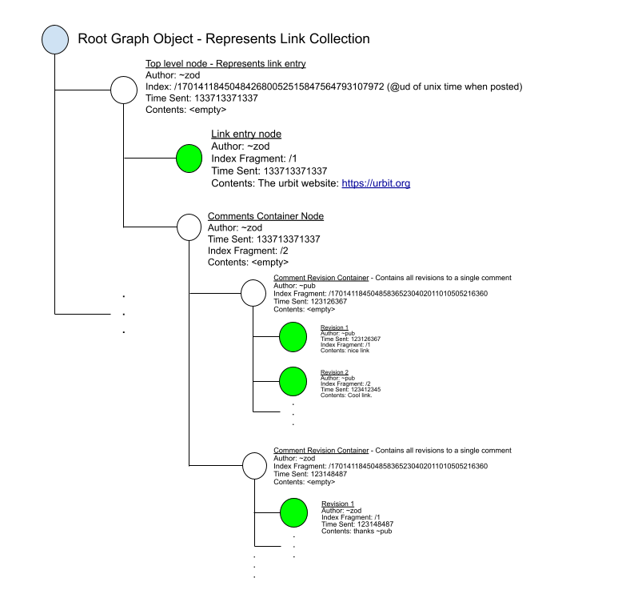
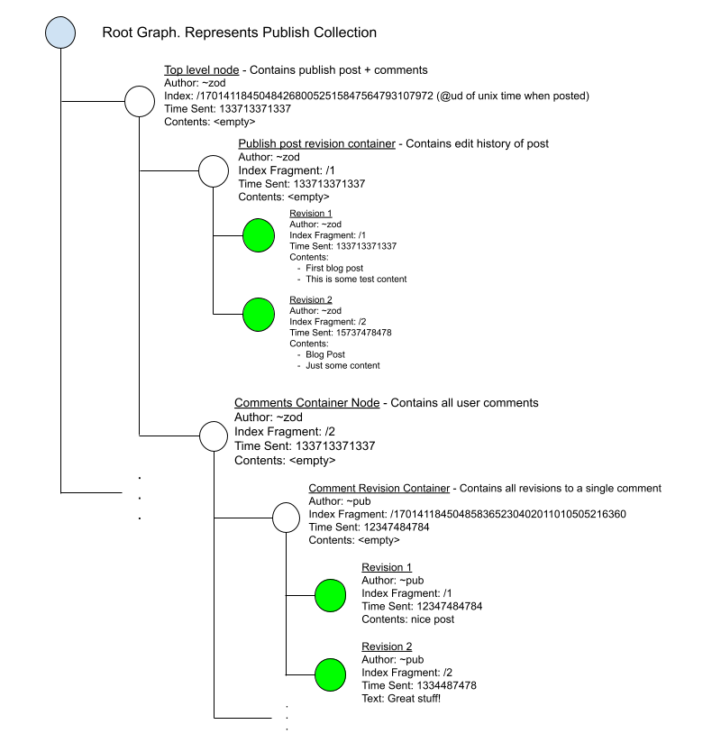

# Graph Store Overview

## Table of Contents

* [Intro](#intro)
* [Data Structures](#data-structures)
  + [Posts](#posts)
  + [Graphs and Nodes](#graphs-and-nodes)
  + [Index](#index)
  + [Structural Nodes vs. Content-Centric Nodes](#structural-nodes-vs-content-centric-nodes)
* [Validator Overview - Schema and Permissions](#validator-overview---schema-and-permissions)

## Intro
Graph store is a non-relational database suitable for use in building social media applications. You should use it if you will be primarily storing text-based content, and your underlying data has threading and nesting (generally, akin to a network). It is not (yet) suitable for binary data, and would probably not be a good fit for storing highly structured data as in a traditional relational database.

  

  
Graph Store is mainly in charge of two things: facilitating data ingress/egress, and validating data against a schema. There are two related tools: Graph Push Hook, which provides permissioning support to Graph Store and acts as a proxy layer to graph-store for outside ships to access, and Graph Pull Hook, which can be used to request Graph Store data from other ships. Importantly, Graph Store proper doesn't know anything about the permissions, and acts in a purely trusted manner (i.e. assuming all inputs are trusted). This is why Graph Push Hook exists: to mediate untrusted requests from outside ships to your graph store, rejecting invalid ones where a ship shouldn’t be able to modify the data.

## Data Structures
### Posts

  

Above, we can see a representation of a post on the left, along with its table form on  the right.
The post is the most basic building block of a graph. 
Every post is made up of an:
- **Author** - the who created the post
- **Index** - the unique path of the post on the graph (more on this later)
- **Time Sent** - when the post was created
- **Contents** - data that the user created / wanted to post

Currently, Graph Store supports 5 data types for content that is to be stored within a graph: 
- **Text** - plain text data
- **Url** - specific data type for urls
- **Mention** - mentioning another ship
- **Code** - a pair of a piece of code that was executed and it’s result (this is static data, no code execution takes place inside of graph-store)
- **Reference** - a reference to another post

This is similar to how traditional databases provide multiple different data types.

### Graphs and Nodes

  

  

A graph is a flat, ordered map of nodes, where each node can have a child graph, which is itself a flat ordered map of nodes. Nodes contain a post and a child graph, although both are optional. In the above diagram, we can see an example of a basic graph on the top, along with the underlying structure of the data in table form underneath.

A few vocab terms:
- **Root graph** refers to the outermost graph, G in this case
- **Top level** is a loose term usually used to refer to a node that exists in the root graph. **A** and **D** would be considered nodes at the top level, but **B** and all its descendants would not qualify.
- **Sibling nodes** are two nodes that reside next to each other, meaning that they reside in the same `graph`. **A** and **D** are an example of sibling nodes.
- We say a node is a **child** of another node if it directly resides within the child graph of that node
- A node is a **parent** to another node if it directly contains the node within its children. An example is the relationship between **B** and **C**: **C** is a child of **B**, while **B** is the parent of **C**
- Another way of saying a node is a child is by saying that node **B** is nested within node **A** Strictly speaking, **C** is not a child of **A**, but we do say that **A** is an **ancestor** of **C**, while **C** is a **descendant** of **A**.
- **Leaf nodes** refer to nodes that do not have children. **C** and **D** are both examples of leaf nodes

### Index

  

Indexes are a way of uniquely identifying a node within a graph. You can think of `index`es as similar to file paths, although they aren’t exactly the same. Roughly, a file path is a unique reference to a file or folder located in the filesystem. Similarly, an index is a unique reference to a node nested within a graph. The written syntax for a full index is very similar to file paths. It consists of every index fragment in order separated by a slash. A node’s level of nesting refers to how deeply it is nested within the context of the root graph. The level of nesting directly corresponds to the number of items in the index. An index fragment is the atom by which a node is uniquely identified within it’s graph, and roughly corresponds to a specific name of a directory along a path. In the diagrams that follow, we’ll use the index fragment instead of the index to avoid repeating redundant information, but please note that internally graph-store uses the full index at every node.

In the above diagram, we would say that nodes **A** and **B** are nested 1 level deep, while **B** would be at the 2nd level of nesting, and **C** would be nested 3 levels deep.

As seen above, indexes are usually numbers. Most commonly, they can represent:
- Date or time of posting
- A sequence of numbers starting from 1 increasing
- Structural/constant value: values which are associated with a specific meaning in the context of the schema of an application.

However, there is no strict requirement for them to be numbers; they can be strings as well as other data types. As we’ll see in the later sections, it is up to the app developer to decide this when creating their application.

### Structural Nodes vs. Content-Centric Nodes

  

When using graph-store, there is a notion of **structural nodes** vs. **content-centric nodes**. In the example diagram, we’ve color coded the different nodes based on what type of node they are. **Content-centric nodes** represent data created or consumed directly by the user. **Structural nodes**, on the other hand do not directly represent user data, and instead represent a higher level relationship between different user data. Structural nodes are used to implement the structure of the schema that is being implemented. In other words, they exist primarily for plumbing purposes.

Note that this differentiation is purely human-facing, and not encoded anywhere within the actual system. Although these patterns aren’t hard or fast rules, we’ll see how they are used in practice in the validator walkthrough section.

## Validator Overview - Schema and Permissions

Every social application has a minimum amount of information it needs to function along with the structure that the information must follow. We’ll call this the application’s schema. This is enforced by a **validator**. A validator's primary function is to encode the constraints of the schema and validate data against the schema of your social media app. Graph Store uses the Hoon type system, specifically marks, to actually represent validators. Validators are a special case of a `mark`, and so the terms may be used interchangeably.

In addition, validators can also encode structural permissions. **Structural permissions** govern who is allowed to add or remove a given node (and by extension its children) based on the node’s properties (usually it’s depth in the graph).

There are 3 different classes of users:
- **Admin** - An owner of a resource or someone who’s been delegated similar privileges
- **Writer** - Someone who can create and modify their own content but cannot modify others’
- **Reader** - Someone who is only given permission to access but not create or modify, except in special cases (such as comments on a post)

There are two different types of privileges:
- **Add privileges** - permission to add (read: create) a given node and add to its children
- **Remove privileges** - permission to remove a given node and remove its children

There are also three different levels of access a given permission level can have:
- **%no** - user does not have add or remove privileges for this node
- **%yes** - user has add or remove privileges for this node, whether or not they authored the parent node
- **%self** - user has add or remove privileges for child nodes only if they authored the parent node (determined by `author` of post, i.e., they are the author of the post)

## [Next](./2_sur_file_walkthrough.md)
## [Home](./README.md)
