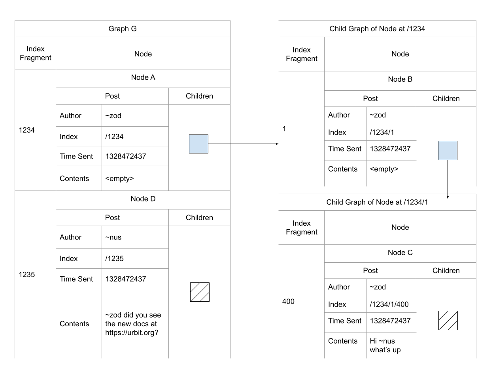
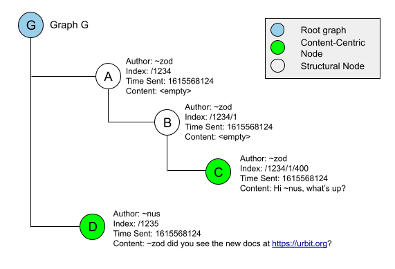

# Graph Store Explainer
## Intro
Graph store is a non-relational database suitable for use in building social media applications. You should use it if you will be primarily storing text-based content, and your underlying data has threading and nesting (generally, akin to a network). It is not (yet) suitable for binary data, and would probably not be a good fit for storing highly structured data as in a traditional relational database.


Graph store is mainly in charge of two things: facilitating data ingress/egress, and validating data against a schema. There are two related tools: Graph Push Hook, which provides permissioning support to graph-store and acts as a proxy layer to graph-store for outside ships to access, and Graph Pull Hook, which can be used to request graph store data from other ships. Importantly, graph store proper doesn't know anything about the permissions, and acts purely in a trusted manner (i.e. assuming all inputs are trusted). This is why Graph Push Hook exists: to mediate untrusted requests from outside ships to your graph store, rejecting invalid ones where a ship shouldn’t be able to modify the data.

## Graph Store overview
### Posts

[]{style="overflow: hidden; display: inline-block; margin: 0.00px 0.00px; border: 0.00px solid #000000; transform: rotate(0.00rad) translateZ(0px); -webkit-transform: rotate(0.00rad) translateZ(0px); width: 624.00px; height: 240.00px;"}


Above, we can see a representation of a post on the left, along with its table form on  the right.
The post is the most basic building block of a graph. 
Every post is made up of an:
- Author - the who created the post
- Index - the unique path of the post on the graph (more on this later)
- Time Sent - when the post was created
- Contents - data that the user created / wanted to post

Currently, Graph Store supports 5 data types for content that is to be stored within a graph: 
- Text - plain text data
- Url - specific data type for urls
- Mention - mentioning another ship
- Code - a pair of a piece of code that was executed and it’s result (this is static data, no code execution takes place inside of graph-store)
- Reference - a reference to another post

This is similar to how traditional databases provide multiple different data types.

### Graphs and Nodes


A graph is a flat, ordered map of nodes, where each node can have a child graph, which is itself a flat ordered map of nodes. Nodes contain a post and a child graph, although both are optional. In the above diagram, we can see an example of a basic graph on the top, along with the underlying structure of the data in table form underneath.

A few vocab terms:
- **Root graph** refers to the outermost graph, G in this case
- **Top level** is a loose term usually used to refer to a node that exists in the root graph. **A** and **B** would be considered nodes at the top level, but **B** and all its descendants would not qualify.
- **Sibling nodes** are two nodes that reside next to each other, meaning that they reside in the same `graph`. **A** and **D** are an example of sibling nodes.
- We say a node is a **child** of another node if it directly resides within the child graph of that node
- A node is a **parent** to another node if it directly contains the node within its children. An example is the relationship between **B** and **C**: **C** is a child of **B**, while **B** is the parent of **C**
- Another way of saying a node is a child is by saying that node **B** is nested within node **A** Strictly speaking, **C** is not a child of **A**, but we do say that **A** is an **ancestor** of **C**, while **C** is a **descendant** of **A**.
- **Leaf nodes** refer to nodes that do not have children. **C** and **D** are both examples of leaf nodes

### Index


Indexes are a way of uniquely identifying a node within a graph. You can think of `index`es as similar to file paths, although they aren’t exactly the same. Roughly, a file path is a unique reference to a file or folder located in the filesystem. Similarly, an index is a unique reference to a node nested within a graph. The written syntax for a full index is very similar to file paths. It consists of every index fragment in order separated by a slash. A node’s level of nesting refers to how deeply it is nested within the context of the root graph. The level of nesting directly corresponds to the number of items in the index. An index fragment is the atom by which a node is uniquely identified within it’s graph, and roughly corresponds to a specific name of a directory along a path. In the diagrams that follow, we’ll use the index fragment instead of the index to avoid repeating redundant information, but please note that internally graph-store uses the full index at every node.

In the above diagram, we would say that nodes **A** and **B** are nested 1 level deep, while **B** would be at the 2nd level of nesting, and **C** would be nested 3 levels deep.

As seen above, indexes are usually numbers. Most commonly, they can represent:
- Date or time of posting
- A sequence of numbers starting from 1 increasing
- Structural/constant value: values which are associated with a specific meaning in the context of the schema of an application.

However, there is no strict requirement for them to be numbers; they can be strings as well as other data types. As we’ll see in the later sections, it is up to the app developer to decide this when creating their application.


### Structural Nodes vs. Content-Centric Nodes


When using graph-store, there is a notion of **structural nodes** vs. **content-centric nodes**. In the example diagram, we’ve color coded the different nodes based on what type of node they are. **Content-centric nodes** represent data created or consumed directly by the user. **Structural nodes**, on the other hand do not directly represent user data, and instead represent a higher level relationship between different user data. Structural nodes are used to implement the structure of the schema that is being implemented. In other words, they exist primarily for plumbing purposes.

Note that this differentiation is purely human-facing, and not encoded anywhere within the actual system. Although these patterns aren’t hard or fast rules, we’ll see how they are used in practice in the validator walkthrough section.

## Validator Overview - Schema and Permissions

Every social application has a minimum amount of information it needs to function along with the structure that the information must follow. We’ll call this the application’s schema. This is enforced by a **validator**. A validator's primary function is to encode the constraints of the schema and validate data against the schema of your social media app. Graph Store uses the Hoon type system, specifically marks, to actually represent validators. Validators are a special case of a `mark`, and so the terms may be used interchangeably.

In addition, validators can also encode structural permissions. **Structural permissions** govern who is allowed to add or remove a given node (and by extension its children) based on the node’s properties (usually it’s depth in the graph).

There are 3 different classes of users:
- Admin - An owner of a resource or someone who’s been delegated the same privileges
- Writer - Someone who can create and modify their own content but cannot modify others’
- Reader - Someone who is only given permission to access but not create or modify, except in special cases (such as comments on a post)

There are two different types of privileges:
- Add privileges - permission to add (read: create) a given node and add to its children
- Remove privileges - permission to remove a given node and remove its children

There are also three different levels of access a given permission level can have:
- %no - user does not have add or remove privileges for this node
- %yes - user has add or remove privileges for this node, whether or not they authored the parent node
- %self - user has add or remove privileges for child nodes only if they authored the parent node (determined by `author` of post, i.e., they are the author of the post)


Permissions for a given node usually come to mimic a table structure as follows:


Permissions for some specific node in the schema
Admin
Writer
Reader
Add privileges
%yes/%no/%self
%yes/%no/%self
%yes/%no/%self
Remove privileges


%yes/%no/%self
%yes/%no/%self
%yes/%no/%self


***

We’ll be taking a look at the validators for 3 of the apps in Landscape built with Graph Store: Chat, Links, and Publish. Before we do that, let’s look at some of the concrete types that graph-store uses.


## Sur File Walkthrough
To gain some clarity, let’s go through the type definitions of some of the most used types when working with Graph Store.

### Post
Here’s sur/post.hoon.
```
+$  index       (list atom)
+$  uid         [=resource =index]
::
::  +sham (half sha-256) hash of +validated-portion
+$  hash  @ux
::
+$  signature   [p=@ux q=ship r=life]
+$  signatures  (set signature)
+$  post
  $:  author=ship
      =index
      time-sent=time
      contents=(list content)
      hash=(unit hash)
      =signatures
  ==
::
+$  indexed-post  [a=atom p=post]
::
+$  validated-portion
  $:  parent-hash=(unit hash)
      author=ship
      time-sent=time
      contents=(list content)
  ==
::
+$  content
  $%  [%text text=cord]
      [%mention =ship]
      [%url url=cord]
      [%code expression=cord output=(list tank)]
      [%reference =uid]
      ::  TODO: maybe use a cask?
      ::[%cage =cage]
  ==
```


**Index**
```
+$  index       (list atom)
+$  uid         [=resource =index]
```

`index` is a list of atoms (big integers). It represents a path to a specific node on a graph that is nested arbitrarily deep.

`uid` is simply a pair of a `resource` and an `index`. With these two pieces of information, you have an unambiguous way to identify a node. It is used in the `content` type to model a reference.

An index fragment is not an explicitly defined type, but since an index is `(list atom)`, it follows that the type of an index fragment is `atom`. This is what gives the developer the flexibility to use more than just numbers in an index.

**Hashing (Part 1)**
```
::  +sham (half sha-256) hash of +validated-portion
+$  hash  @ux
::
+$  signature   [p=@ux q=ship r=life]
+$  signatures  (set signature)
```

These types are used to cryptographically sign a given post, so that the host of some content cannot impersonate the poster. The main one that needs explanation is `signature` which represents a triple of signed message of hash, author, and author’s life at time of posting. These can be used to cryptographically attest to a message. The implementation is a form of asymmetric/public-key encryption, where `q` and `r` are data necessary to look up a ship’s public key on azimuth, which can be used to verify the validity of the message.

**Content Types**
```
+$  content
  $%  [%text text=cord]
      [%mention =ship]
      [%url url=cord]
      [%code expression=cord output=(list tank)]
      [%reference =uid]
      ::  TODO: maybe use a cask?
      ::[%cage =cage]
  ==
--
```

`content` basically enumerates all the possible content types that a post can have. Again for convenience, the possible content types can be:
Text - representing plain text
Url - specific data type for urls
Mention - mentioning another ship
Code - a pair of a piece of code that was executed and it’s result (static data, no execution takes place inside of graph-store)
Reference - a reference to another post

Reference uses the `uid` type under the hood. Currently, these are the only content types supported by graph-store, although there is potential for dynamic content support in the form of a cage.

**Post**
```
+$  post
  $:  author=ship
      =index
      time-sent=time
      contents=(list content)
      hash=(unit hash)
      =signatures
  ==
::
+$  indexed-post  [a=atom p=post]
```

As we’ve seen before, post is one of the more important types. It is the basic wrapper that represents what we normally think of as a “post” on social media. Most of the rest of the types are self-explanatory. `hash` is the optional hash of the post, and `signatures` is the (potentially empty) set of `signature`s if the post is cryptographically signed.

An `indexed-post` is a post with an associated index fragment that can be used to validate a post’s index with an index fragment that is expected at the end of the index list.

**Hashing (Part 2)**
```
+$  validated-portion
  $:  parent-hash=(unit hash)
      author=ship
      time-sent=time
      contents=(list content)
  ==
::
```

The parts of a `post` that are actually hashed to obtain a value of type the earlier type `hash`.


## Graph Store
Here’s sur/graph-store.hoon.

```
+$  graph         ((mop atom node) gth)
+$  marked-graph  [p=graph q=(unit mark)]
::
+$  node          [=post children=internal-graph]
+$  graphs        (map resource marked-graph)
::
+$  internal-graph
  $~  [%empty ~]
  $%  [%graph p=graph]
      [%empty ~]
  ==
::
+$  tag-queries   (jug term resource)
::
::
+$  network
  $:  =graphs
      =tag-queries
      =update-logs
      archive=graphs
      validators=(set mark)
  ==
::
+$  update
  $%  [%0 p=time q=update-0]
  ==
::
+$  update-log    ((mop time logged-update) gth)
+$  update-logs   (map resource update-log)
::
+$  logged-update
  $%  [%0 p=time q=logged-update-0]
  ==
::
+$  logged-update-0
  $%  [%add-graph =resource =graph mark=(unit mark) overwrite=?]
      [%add-nodes =resource nodes=(map index node)]
      [%remove-nodes =resource indices=(set index)]
      [%add-signatures =uid =signatures]
      [%remove-signatures =uid =signatures]
  ==
::


+$  update-0
  $%  logged-update-0
      [%remove-graph =resource]
    ::
      [%add-tag =term =resource]
      [%remove-tag =term =resource]
    ::
      [%archive-graph =resource]
      [%unarchive-graph =resource]
      [%run-updates =resource =update-log]
    ::
    ::  NOTE: cannot be sent as pokes
    ::
      [%keys =resources]
      [%tags tags=(set term)]
      [%tag-queries =tag-queries]
  ==
--
+$  permissions  
  [admin=permission-level writer=permission-level reader=permission-level]
::
::  $permission-level:  levels of permissions in increasing order
::  
::    %no: May not add/remove node
::    %self: May only nodes beneath nodes that were added by
::      the same pilot, may remove nodes that the pilot 'owns'
::    %yes: May add a node or remove node
+$  permission-level
  ?(%no %self %yes)
```

**Graph, Node, and Related Objects**
```
+$  graph         ((mop atom node) gth)
+$  marked-graph  [p=graph q=(unit mark)]
::
+$  node          [=post children=internal-graph]
+$  graphs        (map resource marked-graph)
::
+$  internal-graph
  $~  [%empty ~]
  $%  [%graph p=graph]
      [%empty ~]
  ==
::

+$  network
  $:  =graphs
      =tag-queries
      =update-logs
      archive=graphs
      validators=(set mark)
  ==
::
```

`graph` is a `mop` (ordered map) whose keys are `atom`s representing a node’s index fragment and whose values are `node`s, where entries are sorted by largest valued keys first (defined using the reference to the `gth` greater-than function). This is the fundamental data structure used in `%graph-store` that models a graph, a loosely interconnected set of data which can reference each other and be arbitrarily nested and interconnected.

Here are some helpful wikipedia pages for more info on what this data type represents:
https://en.wikipedia.org/wiki/Graph_(abstract_data_type)
https://en.wikipedia.org/wiki/Graph_database#Background

`node` represents a pair of a `post` and all of its children, which is an `internal-graph`
`internal-graph` is a tagged union representing the state that children can be in. Either a `node` has children in the form of a `graph`, or does not have any and is labeled as `%empty`. 

`marked-graph` is the pair of a `graph` and an optionally present `mark`, which is used by %graph-store to validate a graph against the provided validator (recall that validators are marks).

`graphs` is a mapping between `resource`s and`marked-graph`s

`network` is the highest level data structure used by the %graph-store gall agent to represent all the information that the agent is aware of.

**Tag Queries**

```
+$  tag-queries   (jug term resource)
```

`tag-queries` is a mapping where the keys are terms and the values are a set of resources. It is a simple tagging system that allows for various ad-hoc collections, similar to filesystem tags being used to sort different files/folders. Although it is implemented in graph-store and fully functional, it is currently unused by graph-store itself or any existing applications. While the type’s name is `tag-queries`, there is no complex querying system as of now. Currently, you can add term/resources pairs into the tag queries, get a list of all terms in tag-queries, and get the whole jug out of %graph-store.

**Update (Part 1)**
```
+$  update
  $%  [%0 p=time q=update-0]
  ==
::
+$  logged-update-0
  $%  [%add-graph =resource =graph mark=(unit mark) overwrite=?]
      [%add-nodes =resource nodes=(map index node)]
      [%remove-nodes =resource indices=(set index)]
      [%add-signatures =uid =signatures]
      [%remove-signatures =uid =signatures]
  ==
::
+$  update-0
  $%  logged-update-0
      [%remove-graph =resource]
    ::
      [%add-tag =term =resource]
      [%remove-tag =term =resource]
    ::
      [%archive-graph =resource]
      [%unarchive-graph =resource]
      [%run-updates =resource =update-log]
    ::
    ::  NOTE: cannot be sent as pokes
    ::
      [%keys =resources]
      [%tags tags=(set term)]
      [%tag-queries =tag-queries]
  ==
--
```

The `update` type is what is used to interact with graph-store. It is used both to update subscribers with data (outgoing data) and to write to graph-store itself (incoming data). The first 6 actions are sent as pokes to graph-store in the form of a `graph-update`, which is an alias for `update` above. All actions defined here allow you to create/read/update/delete various objects in a running `graph-store` agent. An `update-0`encapsulates all `logged-update-0` (i.e. any `logged-update-0` is an `update-0` but not necessarily the other way around). The last three actions are scries (essentially readonly requests). They allow you to ask %graph-store for its current state regarding the three entries.

If you want to check out a relevant code listing to see how graph store handles these pokes, see https://github.com/urbit/urbit/blob/e2ad6e3e9219c8bfad62f27f05c7cac94c9effa8/pkg/arvo/app/graph-store.hoon#L221-L227

**Update (Part 2)**
```
+$  update-log    ((mop time logged-update) gth)
+$  update-logs   (map resource update-log)
::
+$  logged-update
  $%  [%0 p=time q=logged-update-0]
  ==
::
```

`update-log` is an ordered map where the keys are a timestamp (time is an alias for @da, an absolute datetime) and the values are `logged-update`s, where entries are sorted with the most recent timestamp first. It represents a history of updates applied to a graph. `update-logs` is a mapping where keys are resources and values are `update-log`s. This is the data structure used by %graph-store to store the history of actions associated with all graphs that it knows about, where each graph has a unique resource that identifies it. A logged-update is a data structure that holds any logged-update-0 along with a time identifying when the update happened. It follows a versioning pattern similar to the versioned state of a %gall agent.

Similar to the urbit event log, graph store also stores all updates that are performed to it, so that it can rebuild its current state on demand. The current state of the database is more of a product of the event log, like a checkpoint, or a materialized db view, rather than the source of truth, which is really in the logged update. As a result, the graph-store database becomes immutable in nature, where all data is preserved and deleted data is only inaccessible in the current view or checkpoint, and is still recoverable by replaying the log.

The reason for having the main CRUD actions being logged-updates is so that graph-store knows which order to process the log entries in when it is rebuilding its current state. The time  associated with the logged update is a way of specifying the canonical order to process the graph-update operations. All other actions that aren’t part of logged-update stand on their own and don’t need a timestamp in order to properly apply them.

**Permissions**
```
+$  permissions  
  [admin=permission-level writer=permission-level reader=permission-level]
::
::  $permission-level:  levels of permissions in increasing order
::  
::    %no: May not add/remove node
::    %self: May only nodes beneath nodes that were added by
::      the same pilot, may remove nodes that the pilot 'owns'
::    %yes: May add a node or remove node
+$  permission-level
  ?(%no %self %yes)
```

These are the types from the permissioning system explained earlier. Notably, `permissions` is just a length-3 cell of `permissions-level`s for admin, writer, and reader respectively, which mimics the table-like format mentioned earlier.

Now that you have an understanding of the `sur` files, we can take a look at some existing graph-store apps and their validators.

## Validator Walkthrough - Schema and Permissioning Implementation
A brief note: the current set of applications use a special type known as `vip-metadata`, which stands for “variation in permission” (not to be confused with VIP meaning “very important person”). It is extra metadata attached to a post that is available to the permissioning arms that is mainly used to specify whether reader comments are enabled or disabled. It is not necessary in order to use %graph-store yourself. Here’s the source if you want to explore: https://github.com/urbit/urbit/blob/ac096d85ae847fcfe8786b51039c92c69abc006e/pkg/arvo/sur/metadata-store.hoon#L20-L30

Anyways, let’s get started.


### Chat
#### Schema
Here’s what the schema of chat looks like:


A chat is a flat graph, where all chat messages are nodes appended to the root of the graph. The graph represents a chat channel and contains all chat messages in order, while a chat message is a child node of the root graph.


Here’s the definition of the schema in the chat validator mark:
File: `mar/graph/validator/chat.hoon`
```

++  grab
  |%
  ++  noun
    |=  p=*                     :: 1
    =/  ip  ;;(indexed-post p)  :: 2
    ?>  ?=([@ ~] index.p.ip)    :: 3
    ip                          :: 4
  --
::
```

Here are the steps:
- Given a noun (we expect an indexed-post)
- Try to coerce p to an indexed-post, crash if doesn’t cast
- Assert that the index of the post of the indexed post is only a single atom, i.e., that it is only nested one level deep
- Return the indexed post

Notably, under this set of rules, there is no nesting allowed. Put another way, no node is allowed to have any children. Nodes can only be added to the root graph. Step 3 is what enforces the flat hierarchy. If someone were to manually try to submit a node with children, graph-store would reject it, preventing them from sending an invalid chat message.

Since the schema of the chat application is simple enough, it has no need for structural nodes at all.

#### Permissioning


Let’s take a look at the permissions table in the diagram.

Chat Message [@ ~]
Add Privileges
Admins and Writers have %yes add permissions for all nodes at the top level, meaning that they have the ability to post chat messages, even if they did not create the chat channel
Readers have %no add privileges for any nodes at the root level, so they do not have the ability to post chat messages
Remove Privileges
Admins and Writers have %self remove privileges, meaning that they may only delete chat messages that they posted, not anyone else’s
Readers have %no remove privileges for any nodes, meaning they cannot delete any chat messages

This follows our general intuition of how permissions for chat messages should be structured.
For example, it wouldn’t make sense to give readers %self, because they do not have the ability to create nodes in the first place, so they will never be in a position to delete any nodes.

Let’s see how this permissioning system is implemented in the validator code.
Here is the `grow` arm of mar/validator/chat.hoon

|_  i=indexed-post              :: A
++  grow
  |%
  ++  graph-permissions-add
    |=  vip=vip-metadata:met  :: 1
    ?+  index.p.i  !!         :: 2
      [@ ~]  [%yes %yes %no]    :: 3
    ==
  ::
  ++  graph-permissions-remove
    |=  vip=vip-metadata:met  :: 4
    ?+  index.p.i  !!         :: 5
      [@ ~]  [%self %self %no]  :: 6
    ==
  ::
  --
::


In line A, we accept an `indexed-post` that is used in the rest of the `grow` arm.

`graph-permissions-add`
Accept a noun `vip` of type vip-metadata
Switch on the index of the post found in `i`, crashing if no successful matches occur
If the index is nested one level deep
Return a `permissions` noun defined as: [admin: %yes, writer: %yes, reader: %no]

`graph-permissions-remove`
Accept a noun `vip` of type vip-metadata
Switch on the index, crashing if no successful matches occur
If the index is nested one level deep
Return a `permissions` noun defined as: [admin: %self, writer: %self, reader: %no]

We can see that not a lot is going on in this example. Just a simple switch statement that matches cases based on the index of the post, and returns the `permissions` values based on the theory explained earlier.


### Links
#### Schema

[]{style="overflow: hidden; display: inline-block; margin: 0.00px 0.00px; border: 0.00px solid #000000; transform: rotate(0.00rad) translateZ(0px); -webkit-transform: rotate(0.00rad) translateZ(0px); width: 624.00px; height: 590.67px;"}


The root graph represents the whole links collection. Every link entry is a child node of this graph. Every link entry is made up of:
The link and its description
A comments section

The comments section holds all individual comment nodes, but comments are not simple leaf nodes. An individual comment is actually a structural node that acts as a revision container, storing the comment’s full edit history by storing each edit as a child node. The frontend is responsible for properly displaying the latest revision of the comment.


Here's the validator, located at `mar/graph/validator/link.hoon`:
```
++  grab
  |%
  ++  noun
    |=  p=*  :: 1
    =/  ip  ;;(indexed-post p)  :: 2
    ?+    index.p.ip  ~|(index+index.p.ip !!)  :: 3
        ::  top-level link post; title and url
        ::
        [@ ~]  :: 4
      ?>  ?=([[%text @] [%url @] ~] contents.p.ip)  :: 4a
      Ip
    ::
        ::  comment on link post; container structure
        ::
        [@ @ ~]  :: 5
      ?>  ?=(~ contents.p.ip)  :: 5a
      ip
    ::
        ::  comment on link post; comment text
        ::
        [@ @ @ ~]  :: 6
      ?>  ?=(^ contents.p.ip)  :: 6a
      ip
    ==
  --
```

Get the post as a noun
Force cast to indexed post
Switch on index of post, crash if no match occurs
If the node is nested one level deep, (if the index is made up of a single atom)
Ensure that it is a cell that has two pieces of data, whose content types are text and url
If the node is nested two levels deep
Ensure that it is empty, this is the structural node for holding comment revisions; it should not contain any content
If the node is nested three levels deep
Ensure that it is a cell, this is a specific revision of a comment under a revision container

It is important to note that you cannot directly edit the url or link afterwards, only the whole link entry itself. This is because you can only add or remove nodes to a graph, not modify them. Comments, however, can be “edited”. This is possible by using a technique called a revision container. Instead of having a single leaf node holding the comment text in its contents, a node with empty contents is created. All revisions of the comment are added as children to this note, and the frontend simply shows the most recent one only.

#### Permissioning

[]{style="overflow: hidden; display: inline-block; margin: 0.00px 0.00px; border: 0.00px solid #000000; transform: rotate(0.00rad) translateZ(0px); -webkit-transform: rotate(0.00rad) translateZ(0px); width: 624.00px; height: 668.00px;"}

[]{style="overflow: hidden; display: inline-block; margin: 0.00px 0.00px; border: 0.00px solid #000000; transform: rotate(0.00rad) translateZ(0px); -webkit-transform: rotate(0.00rad) translateZ(0px); width: 624.00px; height: 782.67px;"}

Let’s analyze the permissions structure.
TODO stubbed out section

Here’s how it is implemented:
|_  i=indexed-post
++  grow
  |%
  ++  noun  i
  ::
  ++  graph-permissions-add
    |=  vip=vip-metadata:met                      :: 1
    =/  reader                                    :: 2
      ?=(%reader-comments vip)
    ?+  index.p.i  !!                             :: 3
      [@ ~]       [%yes %yes %no]                 :: 3a
      [@ @ ~]     [%yes %yes ?:(reader %yes %no)] :: 3b
      [@ @ @ ~]   [%self %self %self]             :: 3c
    ==
  ::
  ++  graph-permissions-remove
    |=  vip=vip-metadata:met                      :: 4
    =/  reader                                    :: 5
      ?=(%reader-comments vip)
    ?+  index.p.i  !!                             :: 6
      [@ ~]       [%yes %self %self]              :: 6a
      [@ @ ~]     [%yes %self %self]              :: 
      [@ @ @ ~]   [%yes %self %self]              :: 
    ==
  ::


`graph-permissions-add`
Accept a noun `vip` of type vip-metadata
Declare a variable `reader`, a flag which is true if reader comments are enabled, false otherwise
Switch on the index of the post found in `i`, crashing if no successful matches occur
If the index is nested one level deep, return a `permissions` noun defined as:
Admin - %yes
Writer - %yes
Reader: %no
If the index is nested two levels deep, return a `permissions` noun defined as:
Admin - %yes
Writer - %yes
Reader: %yes if reader comments are enabled, else %no
If the index is nested three levels deep, return a `permissions` noun defined as:
Admin - %yes
Writer - %yes
Reader: %yes if reader comments are enabled, else %no

`graph-permissions-remove`
Accept a noun `vip` of type vip-metadata
Declare a variable `reader`, a flag which is true if reader comments are enabled, false otherwise
Switch on the index of the post found in `i`, crashing if no successful matches occur
If the index is nested one level deep, two levels deep, or three levels deep, return a `permissions` noun defined as:
Admin - %yes
Writer - %self
Reader: %self

We can see that not a lot is going on in this example. Just a simple switch statement that matches cases based on the index of the post, and returns the `permissions` values based on the theory explained earlier.

### Publish

#### Schema

[]{style="overflow: hidden; display: inline-block; margin: 0.00px 0.00px; border: 0.00px solid #000000; transform: rotate(0.00rad) translateZ(0px); -webkit-transform: rotate(0.00rad) translateZ(0px); width: 624.00px; height: 658.67px;"}

Here, a notebook, which is a collection of blog posts (called notes), is represented by the root graph. All data associated with the blog post is represented by the top level node, which is the note itself along with the associated comments. One level deeper, we see two container structures. The first one is the post revision container; it holds the edit history of your blog post. Every child node of this corresponds to the actual title and text of your blog post. The second one is the comments container. This represents the comment section of your blog post. Every child node of this is not a comment, but a comment revision container, which, as before, contains the edit history of your comment.

Here’s its validator
```
  ++  noun
    |=  p=*  :: 1
    =/  ip  ;;(indexed-post p)  :: 2
    ?+    index.p.ip  !!  :: 3
    ::  top level post must have no content
        [@ ~]  :: 4
      ?>  ?=(~ contents.p.ip)  :: 4a
      ip
    ::  container for revisions
    ::
        [@ %1 ~]   :: 5
      ?>  ?=(~ contents.p.ip)  :: 5a
      ip
    ::  specific revision
    ::  first content is the title
    ::  revisions are numbered by the revision count
    ::  starting at one
        [@ %1 @ ~]  :: 6
      ?>  ?=([* * *] contents.p.ip)  :: 6a
      ?>  ?=(%text -.i.contents.p.ip)  :: 6b
      ip
    ::  container for comments
    ::
        [@ %2 ~]  :: 7
      ?>  ?=(~ contents.p.ip)  :: 7a
      ip
    ::  container for comment revisions
    ::
        [@ %2 @ ~]  :: 8
      ?>  ?=(~ contents.p.ip)  :: 8a
      ip
    ::  specific comment revision
    ::
        [@ %2 @ @ ~]  :: 9
      ?>  ?=(^ contents.p.ip)  :: 9a
      ip
    ==
  --
Walkthrough
```
Get the post as a noun
Force cast to indexed post
Switch on index of post, crashing (reject) if no matches found

If the node is nested one level deep
Ensure that its contents are empty. The top level node is a structural node containing all of the post and associated data.
If it is nested 2 levels deep and contains a 1 as it’s last index fragment
Ensure that its contents are empty. This is a structural node for holding revisions to the blog post.
If the node is nested three levels deep, and has a 1 as it’s second index fragment
Ensure that its contents is a list of at least 2 elements
Ensure that the first element of contents has a content type of text

If the node is nested two levels deep, and has a 2 as it’s last index fragment
Ensure that its contents are empty. This is a structural node for holding comments.
If the node is nested three levels deep, and has a 2 as it’s second index fragment
Ensure that its contents are empty. This is a structural node for holding revisions of a specific comment.
If the node is nested four levels deep, and has a 2 as it’s second index fragment
Ensure that contents has type `cell`. This is a specific revision of a comment

Items 1-3 is setup code
Items 4-6 is for enforcing the schema for the post in general
Items 7-9 is for enforcing the schema for comments specifically

Notably, the revision container for the blog post itself allows the post to be edited, unlike the link entry in the previous example. In addition, in step six, the reason that the validator is made this way is because the first element of the contents is interpreted as the title of the post, and the rest of the elements are interpreted as the body of the post. Otherwise, the structure is unchanged from the Links example.
#### Permissioning

[]{style="overflow: hidden; display: inline-block; margin: 0.00px 0.00px; border: 0.00px solid #000000; transform: rotate(0.00rad) translateZ(0px); -webkit-transform: rotate(0.00rad) translateZ(0px); width: 449.00px; height: 546.67px;"}

[]{style="overflow: hidden; display: inline-block; margin: 0.00px 0.00px; border: 0.00px solid #000000; transform: rotate(0.00rad) translateZ(0px); -webkit-transform: rotate(0.00rad) translateZ(0px); width: 667.07px; height: 541.50px;"}

Let’s take a look at the permissioning structure for Publish. 

TODO stubbed out section

```
|_  i=indexed-post
++  grow
  |%
  ++  noun  i
  ++  graph-permissions-add
    |=  vip=vip-metadata:met                         :: 1
    ?+  index.p.i  !!                                :: 2
      [@ ~]            [%yes %yes %no]  :: new note  :: 2a
      [@ %1 @ ~]       [%self %self %no]             :: 2b
      [@ %2 @ ~]       [%yes %yes ?:(?=(%reader-comments vip) %yes %no)]                                                :: 2c
      [@ %2 @ @ ~]     [%self %self %self]           :: 2d
    ==
  ::
  ++  graph-permissions-remove
    |=  vip=vip-metadata:met                         :: 3
    ?+  index.p.i  !!                                :: 4
      [@ ~]            [%yes %self %self]            :: 4a
      [@ %1 @ @ ~]     [%yes %self %self]            ::
      [@ %2 @ ~]       [%yes %self %self]            :: 
      [@ %2 @ @ ~]     [%yes %self %self]            :: 
    ==
::
```

`graph-permissions-add`
Accept a noun `vip` of type vip-metadata
Switch on the index of the post found in `i`, crashing if no successful matches occur
If the index is nested one level deep, return a `permissions` noun defined as:
Admin - %yes
Writer - %yes
Reader: %no
If the index is nested three levels deep and has a 1 as its 2nd index fragment, return a `permissions` noun defined as:
Admin - %self
Writer - %self
Reader: %no
If the index is nested three levels deep and has a 2 as its 2nd index fragment, return a `permissions` noun defined as:
Admin - %yes
Writer - %yes
Reader: %yes if reader comments are enabled, else %no
If the index is nested four levels deep and has a 2 as its 2nd index fragment, return a `permissions` noun defined as:
Admin - %self
Writer - %self
Reader: %self

`graph-permissions-remove`
Accept a noun `vip` of type vip-metadata
Switch on the index of the post found in `i`, crashing if no successful matches occur
If the index is nested: (a) one level deep, (b) four levels deep with a 1 as it’s 2nd index fragment, (c) three levels deep and has a 2 as its 2nd index fragment, or (d) nested four levels deep and has a 2 as its 2nd index fragment, return a `permissions` noun defined as:
Admin - %yes
Writer - %self
Reader: %self

## Validators - General Patterns and Best Practices
### General Patterns
#### Schemas
The general pattern for enforcing a schema in a validator is to:
- Cast the incoming data as an indexed-post
- Switch on the index, matching by its depth and structure
- Validate the structure of the contents of the post based on what we expect to see at that level of nesting (can be semantically rather than simply presence or absence of data)

When designing your schema, it may help to decide first what data the user will be directly consuming or producing, then try to think of what extra information and structure is needed to support that. For instance, if you may want a user to be able to enter a comment, then later realize that you need a structural node that contains the whole comments section. One pattern that we can see is that all structural nodes tend to have empty contents. Another pattern we can see is that all leaf nodes have their contents set.

In general, validators can be as robust and expressive as desired, because the mark system already sets proper limitations of what you can and cannot do, with the main restriction being no side effects can be produced by a mark.


#### Permissions
In general, you want to first have your schema finalized, then at every node ask the question: who should be able to modify (add/remove) this node, and its children if present in your schema. You may find that you don’t need to set permission for every single type of node afterwards, although being thorough can help to find bugs in permissioning early on. Writing out the permissions in plain words and bullet points, sketching them out in the form of a table, then splitting it up into the code can also make the design process easier.

### Earth/Mars Interface Details
There are a few general ways to talk to graph-store. You can either interact with %graph-store directly from the dojo, or through HTTP requests. You can do pokes/scries/spiders through either the dojo or http. In the case of HTTP requests, get requests can be used for pokes or scries, while post requests can be used to start spider threads. You can also create subscriptions which are long lived connections where you get a continual stream of updates from graph-store.
***

All graph store applications are going to have a mark, which are applied to data going in or coming out.

- In the case of data going in, you pass in a marked-graph which %graph-store uses to validate the whole graph with. In the case of adding a node to a graph, the node will simply be checked for validity using the existing mark since the mark is already set on a per-graph basis.

- In the case of data coming out, eyre forcibly tries to convert the hoon noun into json, and silently fails if no json conversion exists. This process is handled by Graph Store under the hood because all graphs have a well-defined en-json/de-json format, so you never have to worry about making your own (de)serialization arms.

- In addition, eyre lets you choose the mark you scry for by specifying the desired format in the url while making the HTTP request.


Code References
https://github.com/urbit/urbit/blob/master/pkg/interface/src/logic/api/base.ts#L62
https://github.com/urbit/urbit/blob/e2ad6e3e9219c8bfad62f27f05c7cac94c9effa8/pkg/arvo/mar/graph/update.hoon
https://github.com/urbit/urbit/blob/ac096d85ae847fcfe8786b51039c92c69abc006e/pkg/arvo/sys/vane/eyre.hoon#L1617-L1625 shows how eyre applies marks

## Advanced Info
This section is not required but does shed light on some implicit assumptions that graph-store makes.


### Misc. Important Notes
Only nodes that successfully typecheck under the validator will be added to the graph
Graphs are validated recursively (see https://github.com/urbit/urbit/blob/5cb6af0433a65fb28b4bc957be10cb436781392d/pkg/arvo/app/graph-store.hoon#L598-L616)
I.e. first, validate all top level nodes of a graph.
Then, recursively validate all children nodes of those nodes.
Base case: empty children is always valid
Nodes are also validated against the graph’s mark when inserted individually (see https://github.com/urbit/urbit/blob/e2ad6e3e9219c8bfad62f27f05c7cac94c9effa8/pkg/arvo/app/graph-store.hoon#L380)
Only the root level graphs get validated with marks. There is only one mark / validator per graph. All child graphs get validated with the same mark as the root/top-level one.
One important note: the way in which Graph Store works is by mirroring all data from a given social media channel. Thus, anything you see is your copy of it, and anything you do is sent as a request to the hosting ship.


### What happens when you add or remove a node?

When adding nodes, graph-store takes in a flat list of nodes that have nodes whose `index`es are arbitrarily deep. It does not allow for a node which has non-existent ancestors to be added (i.e. it doesn’t silently create the node). Thus, it assumes every node up until the 2nd to last index is created, either already existing or included in the graph-update. To ensure consistent behavior, all nodes are added shallowest-index first, which ensures that no child is added before it’s parent (if it exists). This is why any non-leaf node must have its parent exist, either already within the graph or in the update. However, children do not have to be nested within the parent’s data structure in the update. They simply have to exist somewhere in the update, even at the top level is fine. This is because graph-store merges the flat list of nodes from %add-nodes into the fully connected graph structure.

Another constraint to be aware of is that in a map of indexed nodes: for each node, the index in map entry has to be the same index as the in that `node`’s post index.

To see how graph store handles add-nodes, take a look at https://github.com/urbit/urbit/blob/e2ad6e3e9219c8bfad62f27f05c7cac94c9effa8/pkg/arvo/app/graph-store.hoon#L370-L417.


### Permissions internals
Internally, the permissions part of a mark (the grow arm) are built and then watches for changes by graph-store. See https://github.com/urbit/urbit/blob/ac096d85ae847fcfe8786b51039c92c69abc006e/pkg/arvo/app/graph-push-hook.hoon#L154 for more info.


It is important to note that the push hook and permissions system is bespoke, and doesn’t necessarily fit all permissions schemes out there. In addition, the permissions structure is likely to change, so it can make sense to implement your own permissioning structure (if you are not using graph-push-hook), especially in the case where you are making your own resource control system. The graph-push-hook permissions system is not the definite way to implement permissions, and is simply one pre-existing way to do it. The validator mark doesn’t need any permissions to compile; it just needs a grow arm with at least `noun`. The way to implement your own permissioning structure is in the form of your own grow arm definitions in the validator. There's nothing special about the graph-permission-add arms; they are just constants, arms which are known to push-hook. As stated before, %graph-store proper (app/graph-store.hoon) doesn't know anything about the permissions.

