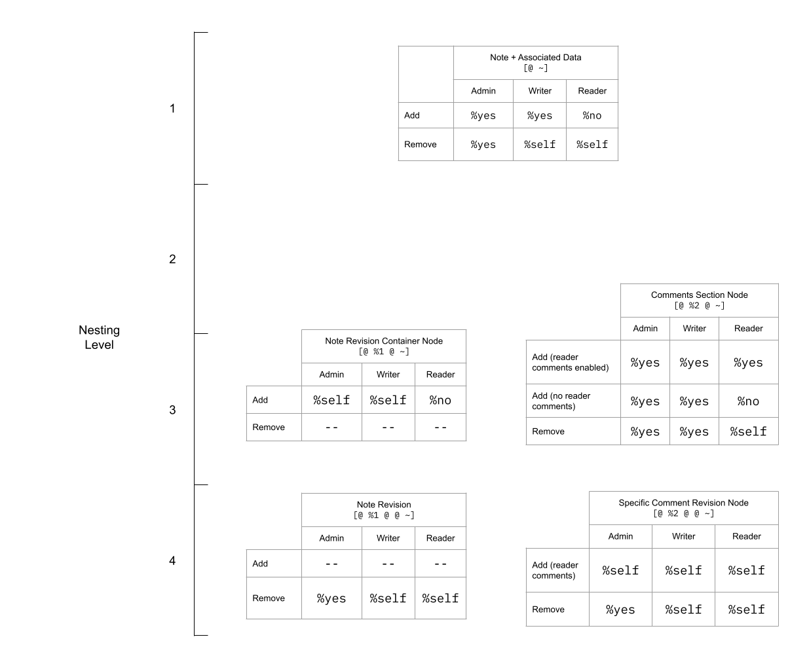

[]{.c2}

[WARNING: Document work in progress. May contain inaccuracies. Information subject to change.]{.c16} {#h.jzt6y75evq2 .c23}
----------------------------------------------------------------------------------------------------

[Document frozen on: 27 Mar 2021. Further changes will be made on the
github repo.]{.c2}

[TODOs]{.c16} {#h.gnpwfzd005qx .c23}
-------------

[Status]{.c2}

-   [Intro - done]{.c2}
-   [Graph Store Overview - done]{.c2}
-   [Validator Overview - done]{.c2}
-   [Sur File Walkthrough - done]{.c2}
-   [Validator Walkthrough]{.c2}

<!-- -->

-   [Chat - done]{.c2}
-   [Links]{.c2}

<!-- -->

-   [Schema - done]{.c2}
-   Permissions - pending source update

<!-- -->

-   [Publish]{.c2}

<!-- -->

-   [Schema - done]{.c2}
-   [Permissions - pending source update]{.c2}

<!-- -->

-   [Validators --- General Patterns - done]{.c2}
-   [Advanced Info - done]{.c2}

[Micro Level stuff]{.c2}

-   [Diagrams could use]{.c2}

<!-- -->

-   [Properly sorted ordering of the nodes in the graph by \`gth\`
    function]{.c2}
-   [Better color scheme]{.c2}
-   [Better font size]{.c2}
-   [Better layouting/spacing]{.c2}
-   [Better/clearer index values]{.c2}
-   [Valid time sent/index data]{.c2}

<!-- -->

-   [Text]{.c2}

<!-- -->

-   [Uniformity in terms used]{.c2}
-   [Grammar punctuation]{.c2}

[]{.c2}

[Final Stuff]{.c2}

-   [Address comments, get input from necessary people]{.c2}
-   [Light editing: Fix up spelling and grammar and sentences etc]{.c2}

------------------------------------------------------------------------

[]{.c2}

------------------------------------------------------------------------

[]{.c36}

[\# Graph Store Explainer]{.c36}

[\#\# Intro]{.c6} {#h.urjlmklj0ap8 .c4}
=================

Graph store is a non-relational database[ suitable for use in building
social media applications. You should use it if you will be primarily
storing text-based content, and your underlying data has threading and
nesting (generally, akin to a network). It is not (yet) suitable for
binary data, and would probably not be a good fit for storing highly
structured data as in a traditional relational database.]{.c2}

[]{style="overflow: hidden; display: inline-block; margin: 0.00px 0.00px; border: 0.00px solid #000000; transform: rotate(0.00rad) translateZ(0px); -webkit-transform: rotate(0.00rad) translateZ(0px); width: 624.00px; height: 349.33px;"}

[]{.c2}

Graph store is mainly in charge of two things: facilitating data
ingress/egress, and validating data against a schema. There are two
related tools: Graph Push Hook, which provides permissioning support to
graph-store and acts as a proxy layer to graph-store for outside ships
to access, and Graph Pull Hook, which can be used to request graph store
data from other ships. Importantly, [graph store proper doesn\'t know
anything about the permissions, and acts purely in a trusted manner
(i.e. assuming all inputs are trusted). ]{.c9}[This is why Graph Push
Hook exists: to mediate untrusted requests from outside ships to your
graph store, rejecting invalid ones where a ship shouldn't be able to
modify the data.]{.c2}

\#\# Graph Store overview {#h.w79mawggbs4l .c4}
=========================

[\#\#\# Posts]{.c16} {#h.38oml3nh7cwa .c23}
--------------------

[]{style="overflow: hidden; display: inline-block; margin: 0.00px 0.00px; border: 0.00px solid #000000; transform: rotate(0.00rad) translateZ(0px); -webkit-transform: rotate(0.00rad) translateZ(0px); width: 624.00px; height: 240.00px;"}

[Above, we can see a representation of a post on the left, along with
its table form on  the right.]{.c2}

[The post is the most basic building block of a graph. ]{.c2}

[Every post is made up of an:]{.c2}

-   [Author - the who created the post]{.c2}
-   [Index - the unique path of the post on the graph (more on this
    later)]{.c2}
-   [Time Sent - when the post was created]{.c2}
-   [Contents - data that the user created / wanted to post]{.c2}

[]{.c2}

[Currently, Graph Store supports 5 data types for content that is to be
stored within a graph: ]{.c2}

-   [Text - plain text data]{.c2}
-   [Url - specific data type for urls]{.c2}
-   [Mention - mentioning another ship]{.c2}
-   [Code - a pair of a piece of code that was executed and it's result
    (this is static data, no code execution takes place inside of
    graph-store)]{.c2}
-   [Reference - a reference to another post]{.c2}

[]{.c2}

[This is similar to how traditional databases provide multiple different
data types.]{.c2}

[\#\#\# Graphs and Nodes]{.c16} {#h.72ejt4ue5xoi .c23}
-------------------------------

[]{.c2}

[]{style="overflow: hidden; display: inline-block; margin: 0.00px 0.00px; border: 0.00px solid #000000; transform: rotate(0.00rad) translateZ(0px); -webkit-transform: rotate(0.00rad) translateZ(0px); width: 569.50px; height: 426.67px;"}

[]{style="overflow: hidden; display: inline-block; margin: 0.00px 0.00px; border: 0.00px solid #000000; transform: rotate(0.00rad) translateZ(0px); -webkit-transform: rotate(0.00rad) translateZ(0px); width: 565.75px; height: 425.33px;"}

[]{.c2}

[A graph is a flat, ordered map of nodes, where each node can have a
child graph, which is itself a flat ordered map of nodes. Nodes contain
a post and a child graph, although both are optional. In the above
diagram, we can see an example of a basic graph on the top, along with
the underlying structure of the data in table form underneath.]{.c2}

[]{.c2}

A few vocab terms:

-   [Root graph]{.c9} refers to the outermost graph, [G]{.c9}[ in this
    case]{.c2}
-   [Top level]{.c9} is a loose term usually used to refer to a node
    that exists in the root graph. [A]{.c9} and [B]{.c9} would be
    considered nodes at the top level, but [B]{.c9} and all its
    descendants would not qualify.
-   [Sibling nodes ]{.c9}are two nodes that reside next to each other,
    meaning that they reside in the same \`graph\`. [A]{.c9} and
    [D]{.c9}[ are an example of sibling nodes.]{.c2}
-   We say a node is a [child]{.c9}[ of another node if it directly
    resides within the child graph of that node]{.c2}
-   A node is a [parent]{.c9} to another node if it directly contains
    the node within its children[. ]{.c9}An example is the relationship
    between [B ]{.c9}and [C]{.c9}: [C]{.c9} is a child of [B]{.c9},
    while [B]{.c9} is the parent of [C]{.c8}
-   Another way of saying a node is a child is by saying that node
    [B]{.c9} is [nested]{.c9} within node [A]{.c9} Strictly speaking,
    [C]{.c9} is not a child of [A]{.c9}, but we do say that A is an
    [ancestor]{.c9} of [C]{.c9}, while [C]{.c9} is a
    [descendant]{.c9} of [A]{.c9}[.]{.c2}
-   [Leaf nodes]{.c9} refer to nodes that do not have children.
    [C]{.c9} and [D]{.c9}[ are both examples of this]{.c2}

[]{.c2}

[\#\#\# Index]{.c16} {#h.uswscgg66m3y .c23}
--------------------

[]{style="overflow: hidden; display: inline-block; margin: 0.00px 0.00px; border: 0.00px solid #000000; transform: rotate(0.00rad) translateZ(0px); -webkit-transform: rotate(0.00rad) translateZ(0px); width: 537.83px; height: 528.00px;"}

Indexes are a way of uniquely identifying a node within a graph. You can
think of \`index\`es as similar to file paths, although they aren't
exactly the same. Roughly, a file path is a unique reference to a file
or folder located in the filesystem. Similarly, an index is a unique
reference to a node nested within a graph. The written syntax for a full
index is very similar to file paths. It consists of every index fragment
in order separated by a slash. A node's [level of nesting]{.c9} refers
to how deeply it is nested within the context of the root graph. The
level of nesting directly corresponds to the number of items in the
index. An [index fragment]{.c9}[ is the atom by which a node is uniquely
identified within it's graph, and roughly corresponds to a specific name
of a directory along a path. In the diagrams that follow, we'll use the
index fragment instead of the index to avoid repeating redundant
information, but please note that internally graph-store uses the full
index at every node.]{.c2}

[]{.c2}

[In the above diagram, we would say that nodes A and B are nested 1
level deep, while B would be at the 2nd level of nesting, and C would be
nested 3 levels deep.]{.c2}

[]{.c2}

[As seen above, indexes are usually numbers. Most commonly, they can
represent:]{.c2}

-   [Date or time of posting]{.c2}
-   [A sequence of numbers starting from 1 increasing]{.c2}
-   [Structural/constant value: values which are associated with a
    specific meaning in the context of the schema of an
    application.]{.c2}

[]{.c2}

[However, there is no strict requirement for them to be numbers; they
can be strings as well as other data types. As we'll see in the later
sections, it is up to the app developer to decide this when creating
their application.]{.c2}

\#\#\# Structural Nodes vs. Content-Centric Nodes {#h.vyprnnhwg3b5 .c23}
-------------------------------------------------

[]{style="overflow: hidden; display: inline-block; margin: 0.00px 0.00px; border: 0.00px solid #000000; transform: rotate(0.00rad) translateZ(0px); -webkit-transform: rotate(0.00rad) translateZ(0px); width: 570.00px; height: 388.06px;"}

When using graph-store, there is a notion of [structural nodes]{.c9} vs.
[content-centric]{.c9} nodes. In the example diagram, we've color coded
the different nodes based on what type of node they are.
[Content-centric nodes]{.c9} represent data created or consumed directly
by the user. [Structural nodes]{.c9}, on the other hand do not directly
represent user data, and instead represent a higher level relationship
between different user data. Structural nodes are used to implement the
structure of the schema that is being implemented[. In other words, they
exist primarily for plumbing purposes.]{.c2}

[]{.c2}

[Note that this differentiation is purely human-facing, and not encoded
anywhere within the actual system. Although these patterns aren't hard
or fast rules, we'll see how they are used in practice in the validator
walkthrough section.]{.c2}

[\#\# Validator Overview - Schema and Permissions]{.c6} {#h.p3yqmr5s84hf .c4}
=======================================================

Every social application has a minimum amount of information it needs to
function along with the structure that the information must follow.
We'll call this the application's schema. One of the responsibilities of
a validator is to encode these constraints and validate [data against
the schema of your social media app. Graph Store uses the Hoon type
system, specifically marks, to actually represent validators. Validators
are a special case of a mark, and so the terms may be used
interchangeably.]{.c2}

[]{.c2}

In addition, validators can also encode [structural permissions]{.c9}.
[Structural permissions ]{.c9}[govern who is allowed to add or remove a
given node (and by extension its children) based on the node's
properties (usually it's depth in the graph).]{.c38}

[]{.c2}

[There are 3 different classes of users:]{.c2}

-   [Admin]{.c9}[ - An owner of a resource or someone who's been
    delegated the same privileges]{.c2}
-   [Writer]{.c9}[ - Someone who can create and modify their own content
    but cannot modify others']{.c2}
-   [Reader]{.c9}[ - Someone who is only given permission to access but
    not create or modify, except in special cases (such as comments on a
    post)]{.c2}

[]{.c2}

[There are two different types of privileges:]{.c2}

-   [Add privileges]{.c9}[ - permission to add (read: create) a given
    node and add to its children]{.c2}
-   [Remove privileges]{.c9}[ - permission to remove a given node and
    remove its children]{.c2}

[]{.c2}

[There are also three different levels of access a given permission
level can have:]{.c2}

-   [%no]{.c9} - user does not have add or remove privileges for this
    node
-   [%yes]{.c9} - user has add or remove privileges for this node,
    [whether or not they authored the parent node]{.c30}
-   [%self]{.c9} - user has add or remove privileges for child nodes
    only if they authored the parent node[ (determined by \`author\` of
    post, i.e., they are the author of the post)]{.c2}

[]{.c2}

[]{.c2}

Permissions for a given node usually come to mimic a table structure as
follows:

[]{.c2}

[]{#t.e4c090385f42aca62c673d39bac0290c64d7cd69}[]{#t.0}

[]{.c2}

[Permissions for some specific node in the schema]{.c2}

[Admin]{.c2}

[Writer]{.c2}

[Reader]{.c2}

[Add privileges]{.c2}

[%yes/%no/%self]{.c34 .c35}

[%yes/%no/%self]{.c34}

[%yes/%no/%self]{.c34}

[Remove privileges]{.c2}

[]{.c2}

[%yes/%no/%self]{.c34}

[%yes/%no/%self]{.c34}

[%yes/%no/%self]{.c34}

[]{.c2}

\*\*\*

We'll be taking a look at the validators for 3 of the apps in Landscape
built with Graph Store: Chat, Links, and Publish[. Before we do that,
let's look at some of the concrete types that graph-store uses.]{.c2}

[]{.c2}

[]{.c2}

------------------------------------------------------------------------

[]{.c2}

\#\# Sur File Walkthrough {#h.dv3loxio13cg .c4}
=========================

[To gain some clarity, let's go through the type definitions of some of
the most used types when working with Graph Store.]{.c2}

[\#\#\# Post]{.c16} {#h.v2del97jvrxx .c23}
-------------------

Here's[ sur/post.hoon]{.c26}.

[]{#t.469fee738117f5d36f76a495a0e1d96989b93962}[]{#t.1}

+-----------------------------------------------------------------------+
| [+\$  index           (list atom)]{.c1}                               |
|                                                                       |
| [+\$  uid             \[=resource =index\]]{.c1}                      |
|                                                                       |
| [::]{.c1}                                                             |
|                                                                       |
| [::  +sham (half sha-256) hash of +validated-portion]{.c1}            |
|                                                                       |
| [+\$  hash  \@ux]{.c1}                                                |
|                                                                       |
| [::]{.c1}                                                             |
|                                                                       |
| [+\$  signature   \[p=\@ux q=ship r=life\]]{.c1}                      |
|                                                                       |
| [+\$  signatures  (set signature)]{.c1}                               |
|                                                                       |
| [+\$  post]{.c1}                                                      |
|                                                                       |
| [  \$:  author=ship]{.c1}                                             |
|                                                                       |
| [          =index]{.c1}                                               |
|                                                                       |
| [          time-sent=time]{.c1}                                       |
|                                                                       |
| [          contents=(list content)]{.c1}                              |
|                                                                       |
| [          hash=(unit hash)]{.c1}                                     |
|                                                                       |
| [          =signatures]{.c1}                                          |
|                                                                       |
| [  ==]{.c1}                                                           |
|                                                                       |
| [::]{.c1}                                                             |
|                                                                       |
| [+\$  indexed-post  \[a=atom p=post\]]{.c1}                           |
|                                                                       |
| [::]{.c1}                                                             |
|                                                                       |
| [+\$  validated-portion]{.c1}                                         |
|                                                                       |
| [  \$:  parent-hash=(unit hash)]{.c1}                                 |
|                                                                       |
| [          author=ship]{.c1}                                          |
|                                                                       |
| [          time-sent=time]{.c1}                                       |
|                                                                       |
| [          contents=(list content)]{.c1}                              |
|                                                                       |
| [  ==]{.c1}                                                           |
|                                                                       |
| [::]{.c1}                                                             |
|                                                                       |
| [+\$  content]{.c1}                                                   |
|                                                                       |
| [  \$%  \[%text text=cord\]]{.c1}                                     |
|                                                                       |
| [          \[%mention =ship\]]{.c1}                                   |
|                                                                       |
| [          \[%url url=cord\]]{.c1}                                    |
|                                                                       |
| [          \[%code expression=cord output=(list tank)\]]{.c1}         |
|                                                                       |
| [          \[%reference =uid\]]{.c1}                                  |
|                                                                       |
| [          ::  TODO: maybe use a cask?]{.c1}                          |
|                                                                       |
| [          ::\[%cage =cage\]]{.c1}                                    |
|                                                                       |
| [  ==]{.c1}                                                           |
+-----------------------------------------------------------------------+

[]{.c1}

[]{.c2}

[]{.c2}

[]{.c2}

[]{.c2}

### [Index]{.c19} {#h.to8ah0al2od6 .c22}

[]{#t.98491e43bc1dcd4deae430aa09aaaef485c45e70}[]{#t.2}

+-----------------------------------------------------------------------+
| [+\$  index           (list atom)]{.c1}                               |
|                                                                       |
| [+\$  uid             \[=resource =index\]]{.c1}                      |
+-----------------------------------------------------------------------+

[\`index\` is a list of atoms (big integers). It represents a path to a
specific node on a graph that is nested arbitrarily deep.]{.c2}

[]{.c2}

[\`uid\` is simply a pair of a \`resource\` and an \`index\`. With these
two pieces of information, you have an unambiguous way to identify a
node. It is used in the \`content\` type to model a reference.]{.c2}

[]{.c2}

[An index fragment is not an explicitly defined type, but since an index
is \`(list atom)\`, it follows that the type of an index fragment is
\`atom\`. This is what gives the developer the flexibility to use more
than just numbers in an index.]{.c2}

[]{.c2}

### [Hashing (Part 1)]{.c19} {#h.r595ezuxrxjp .c22}

[]{#t.d076999a224382f4d011ebcd8d28864578756b72}[]{#t.3}

+-----------------------------------------------------------------------+
| [::  +sham (half sha-256) hash of +validated-portion]{.c1}            |
|                                                                       |
| [+\$  hash  \@ux]{.c1}                                                |
|                                                                       |
| [::]{.c1}                                                             |
|                                                                       |
| [+\$  signature   \[p=\@ux q=ship r=life\]]{.c1}                      |
|                                                                       |
| [+\$  signatures  (set signature)]{.c1}                               |
+-----------------------------------------------------------------------+

[]{.c1}

These types are used to cryptographically sign a given post, so that the
host of some content cannot impersonate the poster. The main one that
needs explanation is \`signature\` which represents a triple of signed
message of hash, author, and author's life at time of posting. These can
be used to cryptographically attest to a message. The implementation is
a form of asymmetric/public-key encryption, where \`q\` and \`r\` are
data necessary to look up a ship's public key on azimuth, which can be
used to verify the validity of the message.

### [Content Types]{.c19} {#h.7cesorqm8gpw .c22}

[]{#t.a368ad9c02f94647f487f5631884f66ae727227a}[]{#t.4}

+-----------------------------------------------------------------------+
| [+\$  content]{.c1}                                                   |
|                                                                       |
| [  \$%  \[%text text=cord\]]{.c1}                                     |
|                                                                       |
| [          \[%mention =ship\]]{.c1}                                   |
|                                                                       |
| [          \[%url url=cord\]]{.c1}                                    |
|                                                                       |
| [          \[%code expression=cord output=(list tank)\]]{.c1}         |
|                                                                       |
| [          \[%reference =uid\]]{.c1}                                  |
|                                                                       |
| [          ::  TODO: maybe use a cask?]{.c1}                          |
|                                                                       |
| [          ::\[%cage =cage\]]{.c1}                                    |
|                                                                       |
| [  ==]{.c1}                                                           |
|                                                                       |
| [\--]{.c1}                                                            |
+-----------------------------------------------------------------------+

\`c[ontent\` basically enumerates all the possible content types that a
post can have. Again for convenience, the possible content types can
be:]{.c2}

-   [Text - representing plain text]{.c2}
-   [Url - specific data type for urls]{.c2}
-   [Mention - mentioning another ship]{.c2}
-   [Code - a pair of a piece of code that was executed and it's result
    (static data, no execution takes place inside of graph-store)]{.c2}
-   [Reference - a reference to another post]{.c2}

[]{.c2}

Reference uses the \`uid\` type under the hood. Currently, these are the
only content types supported by graph-store, although there is potential
for dynamic content support in the form of a cage.

### [Post]{.c19} {#h.3yb0brft32rj .c22}

[]{#t.5616c8dba91fb144a4a692022e174b5416dbc41f}[]{#t.5}

+-----------------------------------------------------------------------+
| [+\$  post]{.c1}                                                      |
|                                                                       |
| [  \$:  author=ship]{.c1}                                             |
|                                                                       |
| [          =index]{.c1}                                               |
|                                                                       |
| [          time-sent=time]{.c1}                                       |
|                                                                       |
| [          contents=(list content)]{.c1}                              |
|                                                                       |
| [          hash=(unit hash)]{.c1}                                     |
|                                                                       |
| [          =signatures]{.c1}                                          |
|                                                                       |
| [  ==]{.c1}                                                           |
|                                                                       |
| [::]{.c1}                                                             |
|                                                                       |
| [+\$  indexed-post  \[a=atom p=post\]]{.c1}                           |
+-----------------------------------------------------------------------+

[]{.c2}

[As we've seen before, post is one of the more important types. It is
the basic wrapper that represents what we normally think of as a "post"
on social media. Most of the rest of the types are self-explanatory.
\`hash\` is the optional hash of the post, and \`signatures\` is the
(potentially empty) set of \`signature\`s if the post is
cryptographically signed.]{.c2}

[]{.c2}

[An \`indexed-post\` is a post with an associated index fragment that
can be used to validate a post's index with an index fragment that is
expected at the end of the index list.]{.c2}

[]{.c1}

### [Hashing (Part 2) ]{.c19} {#h.jjcj6d8bv9lf .c22}

[]{#t.69df5ecf918acd48a6a855017d327ff3772d2ec3}[]{#t.6}

+-----------------------------------------------------------------------+
| [+\$  validated-portion]{.c1}                                         |
|                                                                       |
| [  \$:  parent-hash=(unit hash)]{.c1}                                 |
|                                                                       |
| [          author=ship]{.c1}                                          |
|                                                                       |
| [          time-sent=time]{.c1}                                       |
|                                                                       |
| [          contents=(list content)]{.c1}                              |
|                                                                       |
| [  ==]{.c1}                                                           |
|                                                                       |
| [::]{.c1}                                                             |
+-----------------------------------------------------------------------+

[The parts of a \`post\` that are actually hashed to obtain a value of
type the earlier type \`hash\`.]{.c2}

[\#\# Graph Store]{.c16} {#h.va7cmhvkwdk3 .c23}
------------------------

Here's[ sur/graph-store.hoon]{.c26}[.]{.c2}

[]{.c1}

[]{#t.3bc6f1b099a3dab00dac120cbbea62ca3050de9a}[]{#t.7}

+-----------------------------------------------------------------------+
| [+\$  graph             ((mop atom node) gth)]{.c1}                   |
|                                                                       |
| [+\$  marked-graph  \[p=graph q=(unit mark)\]]{.c1}                   |
|                                                                       |
| [::]{.c1}                                                             |
|                                                                       |
| [+\$  node              \[=post children=internal-graph\]]{.c1}       |
|                                                                       |
| [+\$  graphs            (map resource marked-graph)]{.c1}             |
|                                                                       |
| [::]{.c1}                                                             |
|                                                                       |
| [+\$  internal-graph]{.c1}                                            |
|                                                                       |
| [  \$\~  \[%empty \~\]]{.c1}                                          |
|                                                                       |
| [  \$%  \[%graph p=graph\]]{.c1}                                      |
|                                                                       |
| [          \[%empty \~\]]{.c1}                                        |
|                                                                       |
| [  ==]{.c1}                                                           |
|                                                                       |
| [::]{.c1}                                                             |
|                                                                       |
| [+\$  tag-queries   (jug term resource)]{.c1}                         |
|                                                                       |
| [::]{.c1}                                                             |
|                                                                       |
| [::]{.c1}                                                             |
|                                                                       |
| [+\$  network]{.c1}                                                   |
|                                                                       |
| [  \$:  =graphs]{.c1}                                                 |
|                                                                       |
| [          =tag-queries]{.c1}                                         |
|                                                                       |
| [          =update-logs]{.c1}                                         |
|                                                                       |
| [          archive=graphs]{.c1}                                       |
|                                                                       |
| [          validators=(set mark)]{.c1}                                |
|                                                                       |
| [  ==]{.c1}                                                           |
|                                                                       |
| [::]{.c1}                                                             |
|                                                                       |
| [+\$  update]{.c1}                                                    |
|                                                                       |
| [  \$%  \[%0 p=time q=update-0\]]{.c1}                                |
|                                                                       |
| [  ==]{.c1}                                                           |
|                                                                       |
| [::]{.c1}                                                             |
|                                                                       |
| [+\$  update-log        ((mop time logged-update) gth)]{.c1}          |
|                                                                       |
| [+\$  update-logs   (map resource update-log)]{.c1}                   |
|                                                                       |
| [::]{.c1}                                                             |
|                                                                       |
| [+\$  logged-update]{.c1}                                             |
|                                                                       |
| [  \$%  \[%0 p=time q=logged-update-0\]]{.c1}                         |
|                                                                       |
| [  ==]{.c1}                                                           |
|                                                                       |
| [::]{.c1}                                                             |
|                                                                       |
| [+\$  logged-update-0]{.c1}                                           |
|                                                                       |
| [  \$%  \[%add-graph =resource =graph mark=(unit mark)                |
| overwrite=?\]]{.c1}                                                   |
|                                                                       |
| [          \[%add-nodes =resource nodes=(map index node)\]]{.c1}      |
|                                                                       |
| [          \[%remove-nodes =resource indices=(set index)\]]{.c1}      |
|                                                                       |
| [          \[%add-signatures =uid =signatures\]]{.c1}                 |
|                                                                       |
| [          \[%remove-signatures =uid =signatures\]]{.c1}              |
|                                                                       |
| [  ==]{.c1}                                                           |
|                                                                       |
| [::]{.c1}                                                             |
|                                                                       |
| []{.c1}                                                               |
|                                                                       |
| []{.c1}                                                               |
|                                                                       |
| [+\$  update-0]{.c1}                                                  |
|                                                                       |
| [  \$%  logged-update-0]{.c1}                                         |
|                                                                       |
| [          \[%remove-graph =resource\]]{.c1}                          |
|                                                                       |
| [        ::]{.c1}                                                     |
|                                                                       |
| [          \[%add-tag =term =resource\]]{.c1}                         |
|                                                                       |
| [          \[%remove-tag =term =resource\]]{.c1}                      |
|                                                                       |
| [        ::]{.c1}                                                     |
|                                                                       |
| [          \[%archive-graph =resource\]]{.c1}                         |
|                                                                       |
| [          \[%unarchive-graph =resource\]]{.c1}                       |
|                                                                       |
| [          \[%run-updates =resource =update-log\]]{.c1}               |
|                                                                       |
| [        ::]{.c1}                                                     |
|                                                                       |
| [        ::  NOTE: cannot be sent as pokes]{.c1}                      |
|                                                                       |
| [        ::]{.c1}                                                     |
|                                                                       |
| [          \[%keys =resources\]]{.c1}                                 |
|                                                                       |
| [          \[%tags tags=(set term)\]]{.c1}                            |
|                                                                       |
| [          \[%tag-queries =tag-queries\]]{.c1}                        |
|                                                                       |
| [  ==]{.c1}                                                           |
|                                                                       |
| [\--]{.c1}                                                            |
|                                                                       |
| [+\$  permissions  ]{.c1}                                             |
|                                                                       |
| [  \[admin=permission-level writer=permission-level                   |
| reader=permission-level\]]{.c1}                                       |
|                                                                       |
| [::]{.c1}                                                             |
|                                                                       |
| [::  \$permission-level:  levels of permissions in increasing         |
| order]{.c1}                                                           |
|                                                                       |
| [::  ]{.c1}                                                           |
|                                                                       |
| [::        %no: May not add/remove node]{.c1}                         |
|                                                                       |
| [::        %self: May only nodes beneath nodes that were added        |
| by]{.c1}                                                              |
|                                                                       |
| [::          the same pilot, may remove nodes that the pilot          |
| \'owns\']{.c1}                                                        |
|                                                                       |
| [::        %yes: May add a node or remove node]{.c1}                  |
|                                                                       |
| [+\$  permission-level]{.c1}                                          |
|                                                                       |
| [  ?(%no %self %yes)]{.c1}                                            |
+-----------------------------------------------------------------------+

### []{.c19} {#h.wwctz1mwzips .c22 .c29}

### [Graph, Node, and Related Objects]{.c19} {#h.xmkxo9cib3ek .c22}

[]{#t.95b069dafcebe288ee2ee0783fbab8cbd0d5b303}[]{#t.8}

+-----------------------------------------------------------------------+
| [+\$  graph             ((mop atom node) gth)]{.c1}                   |
|                                                                       |
| [+\$  marked-graph  \[p=graph q=(unit mark)\]]{.c1}                   |
|                                                                       |
| [::]{.c1}                                                             |
|                                                                       |
| [+\$  node              \[=post children=internal-graph\]]{.c1}       |
|                                                                       |
| [+\$  graphs            (map resource marked-graph)]{.c1}             |
|                                                                       |
| [::]{.c1}                                                             |
|                                                                       |
| [+\$  internal-graph]{.c1}                                            |
|                                                                       |
| [  \$\~  \[%empty \~\]]{.c1}                                          |
|                                                                       |
| [  \$%  \[%graph p=graph\]]{.c1}                                      |
|                                                                       |
| [          \[%empty \~\]]{.c1}                                        |
|                                                                       |
| [  ==]{.c1}                                                           |
|                                                                       |
| [::]{.c1}                                                             |
|                                                                       |
| []{.c1}                                                               |
|                                                                       |
| [+\$  network]{.c1}                                                   |
|                                                                       |
| [  \$:  =graphs]{.c1}                                                 |
|                                                                       |
| [          =tag-queries]{.c1}                                         |
|                                                                       |
| [          =update-logs]{.c1}                                         |
|                                                                       |
| [          archive=graphs]{.c1}                                       |
|                                                                       |
| [          validators=(set mark)]{.c1}                                |
|                                                                       |
| [  ==]{.c1}                                                           |
|                                                                       |
| [::]{.c1}                                                             |
+-----------------------------------------------------------------------+

[\`graph\` is a \`mop\` (ordered map) whose keys are \`atom\`s
representing a node's index fragment and whose values are \`node\`s,
where entries are sorted by largest valued keys first (defined using the
reference to the \`gth\` greater-than function). This is the fundamental
data structure used in \`%graph-store\` that models a graph, a loosely
interconnected set of data which can reference each other and be
arbitrarily nested and interconnected.]{.c2}

[]{.c2}

[Here are some helpful wikipedia pages for more info on what this data
type represents:]{.c2}

-   [[https://en.wikipedia.org/wiki/Graph\_(abstract\_data\_type)](https://www.google.com/url?q=https://en.wikipedia.org/wiki/Graph_(abstract_data_type)&sa=D&source=editors&ust=1616863784381000&usg=AOvVaw28BpPVtDvboII1hegkz7co){.c14}]{.c27}
-   [[https://en.wikipedia.org/wiki/Graph\_database\#Background](https://www.google.com/url?q=https://en.wikipedia.org/wiki/Graph_database%23Background&sa=D&source=editors&ust=1616863784382000&usg=AOvVaw09pnqUnr2dUVMpt6GYC_lJ){.c14}]{.c27}

[]{.c2}

[\`node\` represents a pair of a \`post\` and all of its children, which
is an \`internal-graph\`]{.c2}

[\`internal-graph\` is a tagged union representing the state that
children can be in. Either a \`node\` has children in the form of a
\`graph\`, or does not have any and is labeled as \`%empty\`. ]{.c2}

[]{.c2}

[\`marked-graph\` is the pair of a \`graph\` and an optionally present
\`mark\`, which is used by %graph-store to validate a graph against the
provided validator (recall that validators are marks).]{.c2}

[]{.c2}

[\`graphs\` is a mapping between \`resource\`s
and\`marked-graph\`s]{.c2}

[]{.c2}

[\`network\` is the highest level data structure used by the
%graph-store gall agent to represent all the information that the agent
is aware of.]{.c2}

[]{.c1}

### [Tag Queries]{.c19} {#h.9zwi7uwb31vo .c22}

[]{#t.279b78e58e271144629ad8fcc5052c2865c06d7b}[]{#t.9}

+-----------------------------------------------------------------------+
| [+\$  tag-queries   (jug term resource)]{.c1}                         |
+-----------------------------------------------------------------------+

\`tag-queries[\` is a mapping where the keys are terms and the values
are a set of resources. It is a simple tagging system that allows for
various ad-hoc collections, similar to filesystem tags being used to
sort different files/folders. Although it is implemented in graph-store
and fully functional, it is currently unused by graph-store itself or
any existing applications. While the type's name is \`tag-queries\`,
there is no complex querying system as of now. Currently, you can add
term/resources pairs into the tag queries, get a list of all terms in
tag-queries, and get the whole jug out of %graph-store.]{.c2}

### [Update (Part 1)]{.c19} {#h.fosjul3gxs9z .c22}

[]{#t.3cd0aad741e18f89f6155c2720d70b3419035fa5}[]{#t.10}

+-----------------------------------------------------------------------+
| [+\$  update]{.c1}                                                    |
|                                                                       |
| [  \$%  \[%0 p=time q=update-0\]]{.c1}                                |
|                                                                       |
| [  ==]{.c1}                                                           |
|                                                                       |
| [::]{.c1}                                                             |
|                                                                       |
| [+\$  logged-update-0]{.c1}                                           |
|                                                                       |
| [  \$%  \[%add-graph =resource =graph mark=(unit mark)                |
| overwrite=?\]]{.c1}                                                   |
|                                                                       |
| [          \[%add-nodes =resource nodes=(map index node)\]]{.c1}      |
|                                                                       |
| [          \[%remove-nodes =resource indices=(set index)\]]{.c1}      |
|                                                                       |
| [          \[%add-signatures =uid =signatures\]]{.c1}                 |
|                                                                       |
| [          \[%remove-signatures =uid =signatures\]]{.c1}              |
|                                                                       |
| [  ==]{.c1}                                                           |
|                                                                       |
| [::]{.c1}                                                             |
|                                                                       |
| [+\$  update-0]{.c1}                                                  |
|                                                                       |
| [  \$%  logged-update-0]{.c1}                                         |
|                                                                       |
| [          \[%remove-graph =resource\]]{.c1}                          |
|                                                                       |
| [        ::]{.c1}                                                     |
|                                                                       |
| [          \[%add-tag =term =resource\]]{.c1}                         |
|                                                                       |
| [          \[%remove-tag =term =resource\]]{.c1}                      |
|                                                                       |
| [        ::]{.c1}                                                     |
|                                                                       |
| [          \[%archive-graph =resource\]]{.c1}                         |
|                                                                       |
| [          \[%unarchive-graph =resource\]]{.c1}                       |
|                                                                       |
| [          \[%run-updates =resource =update-log\]]{.c1}               |
|                                                                       |
| [        ::]{.c1}                                                     |
|                                                                       |
| [        ::  NOTE: cannot be sent as pokes]{.c1}                      |
|                                                                       |
| [        ::]{.c1}                                                     |
|                                                                       |
| [          \[%keys =resources\]]{.c1}                                 |
|                                                                       |
| [          \[%tags tags=(set term)\]]{.c1}                            |
|                                                                       |
| [          \[%tag-queries =tag-queries\]]{.c1}                        |
|                                                                       |
| [  ==]{.c1}                                                           |
|                                                                       |
| [\--]{.c1}                                                            |
+-----------------------------------------------------------------------+

[]{.c2}

[The \`update\` type is what is used to interact with graph-store. It is
used both to update subscribers with data (outgoing data) and to write
to graph-store itself (incoming data). The first 6 actions are sent as
pokes to graph-store in the form of a \`graph-update\`, which is an
alias for \`update\` above. All actions defined here allow you to
create/read/update/delete various objects in a running \`graph-store\`
agent. An \`update-0\`encapsulates all \`logged-update-0\` (i.e. any
\`logged-update-0\` is an \`update-0\` but not necessarily the other way
around). The last three actions are scries (essentially readonly
requests). They allow you to ask %graph-store for its current state
regarding the three entries.]{.c2}

[]{.c2}

If you want to check out a relevant code listing to see how graph store
handles these pokes, see
[[https://github.com/urbit/urbit/blob/e2ad6e3e9219c8bfad62f27f05c7cac94c9effa8/pkg/arvo/app/graph-store.hoon\#L221-L227](https://www.google.com/url?q=https://github.com/urbit/urbit/blob/e2ad6e3e9219c8bfad62f27f05c7cac94c9effa8/pkg/arvo/app/graph-store.hoon%23L221-L227&sa=D&source=editors&ust=1616863784396000&usg=AOvVaw3HLQ4pBq72kfCtmYe45RSW){.c14}]{.c27}

### [Update (Part 2)]{.c19} {#h.f0zdcne4j05l .c22}

[]{#t.613b8216eacce8e3d64d956da1c601bade4abed1}[]{#t.11}

+-----------------------------------------------------------------------+
| [+\$  update-log        ((mop time logged-update) gth)]{.c1}          |
|                                                                       |
| [+\$  update-logs   (map resource update-log)]{.c1}                   |
|                                                                       |
| [::]{.c1}                                                             |
|                                                                       |
| [+\$  logged-update]{.c1}                                             |
|                                                                       |
| [  \$%  \[%0 p=time q=logged-update-0\]]{.c1}                         |
|                                                                       |
| [  ==]{.c1}                                                           |
|                                                                       |
| [::]{.c1}                                                             |
+-----------------------------------------------------------------------+

\`update-log\` is an ordered map where the keys are a timestamp (time is
an alias for \@da, an absolute datetime) and the values are
\`logged-update\`s, where entries are sorted with the most recent
timestamp first. It represents a history of updates applied to a graph.
\`update-logs\` is a mapping where keys are resources and values are
\`update-log\`s. This is the data structure used by %graph-store to
store the history of actions associated with all graphs that it knows
about, where each graph has a unique resource that identifies it. A
logged-update is a data structure that holds any logged-update-0 along
with a time identifying when the update happened.[ It follows a
versioning pattern similar to the versioned state of a %gall
agent.]{.c2}

[]{.c2}

[Similar to the urbit event log, graph store also stores all updates
that are performed to it, so that it can rebuild its current state on
demand. The current state of the database is more of a product of the
event log, like a checkpoint, or a materialized db view, rather than the
source of truth, which is really in the logged update. As a result, the
graph-store database becomes immutable in nature, where all data is
preserved and deleted data is only inaccessible in the current view or
checkpoint, and is still recoverable by replaying the log.]{.c2}

[]{.c2}

The reason for having the main CRUD actions being logged-updates is so
that graph-store knows which order to process the log entries in when it
is rebuilding its current state. The time  associated with the logged
update is a way of specifying the canonical order to process the
graph-update operations. All other actions that aren't part of
logged-update stand on their own and don't need a timestamp in order to
properly apply them.

### [Permissions]{.c19} {#h.765xab3c0vcj .c22}

[]{#t.ef7cc73f8c03953857318693f1460877664e2a5a}[]{#t.12}

+-----------------------------------------------------------------------+
| [+\$  permissions  ]{.c1}                                             |
|                                                                       |
| [  \[admin=permission-level writer=permission-level                   |
| reader=permission-level\]]{.c1}                                       |
|                                                                       |
| [::]{.c1}                                                             |
|                                                                       |
| [::  \$permission-level:  levels of permissions in increasing         |
| order]{.c1}                                                           |
|                                                                       |
| [::  ]{.c1}                                                           |
|                                                                       |
| [::        %no: May not add/remove node]{.c1}                         |
|                                                                       |
| [::        %self: May only nodes beneath nodes that were added        |
| by]{.c1}                                                              |
|                                                                       |
| [::          the same pilot, may remove nodes that the pilot          |
| \'owns\']{.c1}                                                        |
|                                                                       |
| [::        %yes: May add a node or remove node]{.c1}                  |
|                                                                       |
| [+\$  permission-level]{.c1}                                          |
|                                                                       |
| [  ?(%no %self %yes)]{.c1}                                            |
+-----------------------------------------------------------------------+

[]{.c2}

[These are the types from the permissioning system explained earlier.
Notably, \`permissions\` is just a length-3 cell of
\`permissions-level\`s for admin, writer, and reader respectively, which
mimics the table-like format mentioned earlier.]{.c2}

[]{.c2}

[Now that you have an understanding of the \`sur\` files, we can take a
look at some existing graph-store apps and their validators.]{.c2}

[\#\# Validator Walkthrough - Schema and Permissioning Implementation]{.c6} {#h.30846qfwyh5p .c4}
===========================================================================

A brief note: the current set of applications use a special type known
as \`vip-metadata\`, which stands for "variation in permission" (not to
be confused with VIP meaning "very important person"). It is extra
metadata attached to a post that is available to the permissioning arms
that is mainly used to specify whether reader comments are enabled or
disabled. It is [not]{.c30} necessary in order to use
%graph-store yourself. Here's the source if you want to explore:
[[https://github.com/urbit/urbit/blob/ac096d85ae847fcfe8786b51039c92c69abc006e/pkg/arvo/sur/metadata-store.hoon\#L20-L30](https://www.google.com/url?q=https://github.com/urbit/urbit/blob/ac096d85ae847fcfe8786b51039c92c69abc006e/pkg/arvo/sur/metadata-store.hoon%23L20-L30&sa=D&source=editors&ust=1616863784408000&usg=AOvVaw2axrJaNoXayuoPWa1tSiyl){.c14}]{.c27}

[]{.c2}

[Anyways, let's get started.]{.c2}

[\#\#\# Chat]{.c16} {#h.amffh61eu1ya .c23}
-------------------

### [\#\#\#\# Schema]{.c19} {#h.ceo2jr8cmc4e .c22}

Here's what the schema of chat looks like[:]{.c2}

[]{style="overflow: hidden; display: inline-block; margin: 0.00px 0.00px; border: 0.00px solid #000000; transform: rotate(0.00rad) translateZ(0px); -webkit-transform: rotate(0.00rad) translateZ(0px); width: 599.50px; height: 495.74px;"}

[A chat is a flat graph, where all chat messages are nodes appended to
the root of the graph. The graph represents a chat channel and contains
all chat messages in order, while a chat message is a child node of the
root graph.]{.c2}

[]{.c2}

[]{.c2}

[Here's the definition of the schema in the chat validator mark:]{.c2}

[]{.c2}

[]{#t.c7033543e55dc90afe6a7770ed88a792b8a86c1d}[]{#t.13}

+-----------------------------------------------------------------------+
| [:: file: mar/graph/validator/chat.hoon]{.c1}                         |
|                                                                       |
| [++  grab]{.c1}                                                       |
|                                                                       |
| [  \|%]{.c1}                                                          |
|                                                                       |
| [  ++  noun]{.c1}                                                     |
|                                                                       |
| [        \|=  p=\*                     :: ]{.c26}[1]{.c1}             |
|                                                                       |
| [        =/  ip  ;;(indexed-post p)  :: ]{.c26}[2]{.c1}               |
|                                                                       |
| [        ?\>  ?=(\[@ \~\] index.p.ip)    :: ]{.c26}[3]{.c1}           |
|                                                                       |
| [        ip                          :: ]{.c26}[4]{.c1}               |
|                                                                       |
| [  \--]{.c1}                                                          |
|                                                                       |
| [::]{.c1}                                                             |
+-----------------------------------------------------------------------+

[]{.c2}

Here are the steps:

1.  [Given a noun (we expect an indexed-post)]{.c2}
2.  [Try to coerce p to an indexed-post, crash if doesn't cast]{.c2}
3.  [Assert that the index of the post of the indexed post is only a
    single atom, i.e., that it is only nested one level deep]{.c2}
4.  [Return the indexed post]{.c2}

[]{.c2}

[Notably, under this set of rules, there is no nesting allowed. Put
another way, no node is allowed to have any children. Nodes can only be
added to the root graph. Step 3 is what enforces the flat hierarchy. If
someone were to manually try to submit a node with children, graph-store
would reject it, preventing them from sending an invalid chat
message.]{.c2}

[]{.c2}

[Since the schema of the chat application is simple enough, it has no
need for structural nodes at all.]{.c2}

### [\#\#\#\# Permissioning]{.c19} {#h.fn720alm6ofs .c22}

[]{style="overflow: hidden; display: inline-block; margin: 0.00px 0.00px; border: 0.00px solid #000000; transform: rotate(0.00rad) translateZ(0px); -webkit-transform: rotate(0.00rad) translateZ(0px); width: 541.00px; height: 446.67px;"}

[Let's take a look at the permissions table in the diagram.]{.c2}

[]{.c2}

[Chat Message \[@ \~\]]{.c2}

-   [Add Privileges]{.c2}

<!-- -->

-   Admins and Writers have [%yes]{.c9}[ add permissions for all nodes
    at the top level, meaning that they have the ability to post chat
    messages, even if they did not create the chat channel]{.c2}

<!-- -->

-   Readers have [%no]{.c9} [add privileges for any nodes at the root
    level, so they do not have the ability to post chat messages]{.c2}

<!-- -->

-   [Remove Privileges]{.c2}

<!-- -->

-   Admins and Writers have [%self]{.c9} [remove privileges, meaning
    that they may only delete chat messages that they posted, not anyone
    else's]{.c2}
-   Readers have [%no]{.c9} [remove privileges for any nodes, meaning
    they cannot delete any chat messages]{.c2}

[]{.c2}

[This follows our general intuition of how permissions for chat messages
should be structured.]{.c2}

For example, it wouldn't make sense to give readers [%self]{.c9}[,
because they do not have the ability to create nodes in the first place,
so they will never be in a position to delete any nodes.]{.c2}

[]{.c2}

[Let's see how this permissioning system is implemented in the validator
code.]{.c2}

[Here is the \`grow\` arm of mar/validator/chat.hoon]{.c2}

[]{.c2}

[]{#t.c6cae441f5c2a311d2814d518ee3e72a467c9e55}[]{#t.14}

+-----------------------------------------------------------------------+
| [\|\_  i=indexed-post              :: A]{.c1}                         |
|                                                                       |
| [++  grow]{.c1}                                                       |
|                                                                       |
| [  \|%]{.c1}                                                          |
|                                                                       |
| [  ++  graph-permissions-add]{.c1}                                    |
|                                                                       |
| [        \|=  vip=vip-metadata:met  :: 1]{.c1}                        |
|                                                                       |
| [        ?+  index.p.i  !!         :: 2]{.c1}                         |
|                                                                       |
| [          \[@ \~\]  \[%yes %yes %no\]    :: 3]{.c1}                  |
|                                                                       |
| [        ==]{.c1}                                                     |
|                                                                       |
| [  ::]{.c1}                                                           |
|                                                                       |
| [  ++  graph-permissions-remove]{.c1}                                 |
|                                                                       |
| [        \|=  vip=vip-metadata:met  :: 4]{.c1}                        |
|                                                                       |
| [        ?+  index.p.i  !!         :: 5]{.c1}                         |
|                                                                       |
| [          \[@ \~\]  \[%self %self %no\]  :: 6]{.c1}                  |
|                                                                       |
| [        ==]{.c1}                                                     |
|                                                                       |
| [  ::]{.c1}                                                           |
|                                                                       |
| [  \--]{.c1}                                                          |
|                                                                       |
| [::]{.c1}                                                             |
+-----------------------------------------------------------------------+

[]{.c2}

In line [A]{.c9}[, we accept an \`indexed-post\` that is used in the
rest of the \`grow\` arm.]{.c2}

[]{.c2}

[\`graph-permissions-add\`]{.c2}

1.  [Accept a noun \`vip\` of type vip-metadata]{.c2}
2.  [Switch on the index of the post found in \`i\`, crashing if no
    successful matches occur]{.c2}
3.  [If the index is nested one level deep]{.c2}

<!-- -->

1.  [Return a \`permissions\` noun defined as: \[admin: %yes, writer:
    %yes, reader: %no\]]{.c2}

[]{.c2}

[\`graph-permissions-remove\`]{.c2}

4.  [Accept a noun \`vip\` of type vip-metadata]{.c2}
5.  [Switch on the index, crashing if no successful matches occur]{.c2}
6.  [If the index is nested one level deep]{.c2}

<!-- -->

1.  [Return a \`permissions\` noun defined as: \[admin: %self, writer:
    %self, reader: %no\]]{.c2}

[]{.c2}

[We can see that not a lot is going on in this example. Just a simple
switch statement that matches cases based on the index of the post, and
returns the \`permissions\` values based on the theory explained
earlier.]{.c2}

[]{.c2}

[]{.c2}

[\#\#\# Links]{.c16} {#h.jxwpfbq3wdtm .c23}
--------------------

### [\#\#\#\# Schema]{.c19} {#h.vsqtg3a4jru6 .c22}

[]{style="overflow: hidden; display: inline-block; margin: 0.00px 0.00px; border: 0.00px solid #000000; transform: rotate(0.00rad) translateZ(0px); -webkit-transform: rotate(0.00rad) translateZ(0px); width: 624.00px; height: 590.67px;"}

The[ root graph represents the whole links collection. Every link entry
is a child node of this graph. Every link entry is made up of:]{.c2}

-   [The link and its description]{.c2}
-   [A comments section]{.c2}

[]{.c2}

The comments section holds all individual comment nodes, but comments
are not simple leaf nodes. An individual comment is actually a
structural node that acts as a [revision container]{.c9}[, storing the
comment's full edit history by storing each edit as a child node. The
frontend is responsible for properly displaying the latest revision of
the comment.]{.c2}

[]{.c2}

[]{.c2}

[Here\'s the validator, located at
\`mar/graph/validator/link.hoon\`:]{.c2}

[\`\`\`]{.c2}

[++  grab]{.c2}

[  \|%]{.c2}

[  ++  noun]{.c2}

        \|=  p=\*  :: [1]{.c9}

        =/  ip  ;;(indexed-post p)  :: [2]{.c9}

        ?+        index.p.ip  \~\|(index+index.p.ip !!)  :: [3]{.c8}

[            ::  top-level link post; title and url]{.c2}

[            ::]{.c2}

            \[@ \~\]  :: [4]{.c8}

          ?\>  ?=(\[\[%text @\] \[%url @\] \~\] contents.p.ip)  ::
[4a]{.c8}

[          Ip]{.c2}

[        ::]{.c2}

[            ::  comment on link post; container structure]{.c2}

[            ::]{.c2}

            \[@ @ \~\]  :: [5]{.c8}

          ?\>  ?=(\~ contents.p.ip)  :: [5a]{.c8}

[          ip]{.c2}

[        ::]{.c2}

[            ::  comment on link post; comment text]{.c2}

[            ::]{.c2}

            \[@ @ @ \~\]  :: [6]{.c8}

          ?\>  ?=(\^ contents.p.ip)  :: [6a]{.c8}

[          ip]{.c2}

[        ==]{.c2}

[  \--]{.c2}

[\`\`\`]{.c2}

[]{.c2}

1.  [Get the post as a noun]{.c2}
2.  [Force cast to indexed post]{.c2}
3.  [Switch on index of post, crash if no match occurs]{.c2}
4.  If the node is nested one level deep, (if the index is made up of a
    single atom[)]{.c2}

<!-- -->

1.  Ensure that it is a cell that has two pieces of data[, whose content
    types are text and url]{.c2}

<!-- -->

5.  [If the node is nested two levels deep]{.c2}

<!-- -->

1.  [Ensure that it is empty, this is the structural node for holding
    comment revisions; it should not contain any content]{.c2}

<!-- -->

6.  [If the node is nested three levels deep]{.c2}

<!-- -->

1.  [Ensure that it is a cell, this is a specific revision of a comment
    under a revision container]{.c2}

[]{.c2}

It is important to note that you cannot directly edit the url or link
afterwards, only the whole link entry itself. This is because you can
only add or remove nodes to a graph, not modify them. Comments, however,
[can]{.c30}[ be "edited". This is possible by using a technique called a
revision container. Instead of having a single leaf node holding the
comment text in its contents, a node with empty contents is created. All
revisions of the comment are added as children to this note, and the
frontend simply shows the most recent one only.]{.c2}

[]{.c2}

### [\#\#\#\# Permissioning]{.c19} {#h.kxyj9ohy90f .c22}

[]{style="overflow: hidden; display: inline-block; margin: 0.00px 0.00px; border: 0.00px solid #000000; transform: rotate(0.00rad) translateZ(0px); -webkit-transform: rotate(0.00rad) translateZ(0px); width: 624.00px; height: 668.00px;"}

[]{style="overflow: hidden; display: inline-block; margin: 0.00px 0.00px; border: 0.00px solid #000000; transform: rotate(0.00rad) translateZ(0px); -webkit-transform: rotate(0.00rad) translateZ(0px); width: 624.00px; height: 782.67px;"}

[]{.c2}

[Let's analyze the permissions structure.]{.c2}

[At level 1,]{.c2}

-   [Link Post \[@ \~\]]{.c2}

<!-- -->

-   [Add]{.c2}

<!-- -->

-   Admins and Writers have [%yes]{.c9}[ add privileges, meaning that
    they can create new link posts and edit others' posts.]{.c2}
-   [Readers have %no add privileges, meaning that they cannot create
    new link posts]{.c2}

<!-- -->

-   [Remove]{.c2}

<!-- -->

-   Admins and Writers have [%self]{.c9}[ remove privileges, meaning
    that they can only remove link posts that they themselves created,
    not anyone else's]{.c2}
-   Readers have neither [%no]{.c9}[ remove privileges, so they cannot
    remove any link posts]{.c2}

[At level 2,]{.c2}

-   [Link Entry Node or Comments Section Container Node \[@ @ \~\]]{.c2}

<!-- -->

-   [Add]{.c2}

<!-- -->

-   Admins and Writers unconditionally have [%yes]{.c9} [add privileges,
    meaning that they are able to create the link entry nodes on their
    own link entries or others'. The are also able to add and remove
    anyone's comment section container node]{.c2}
-   Readers have %yes add privileges at this level only if reader
    comments are enabled for the post, meaning that they
    ^[\[a\]](#cmnt1){#cmnt_ref1}^[can only add comments if reader
    comments is enabled]{.c2}

<!-- -->

-   [Remove]{.c2}

<!-- -->

-   Admins have [%yes]{.c9}[ remove privileges, which means that they
    can remove anyone's link entry or the comments section
    entirely]{.c2}
-   Writers and Readers have [%self]{.c9}[ remove privileges, which
    means that they can remove a link entry or comments section under
    their own link post. In practice, readers will never own a link post
    in the first place, but may own their own comment revision
    container.]{.c2}

[At level 3,]{.c2}

-   [Comment Revision Container \[@ @ @ \~\]]{.c2}

<!-- -->

-   [Add]{.c2}

<!-- -->

-   Admins, Writers, and Readers all have %self add permissions, meaning
    that anyone can create a comment revision under their own comment
    revisions container^[\[b\]](#cmnt2){#cmnt_ref2}^
-   [Everyone has %self permission-level for both add and remove
    privileges so they can add and remove their own comments, except
    admins who have %yes permission-level for remove permissions, so
    they can delete anyone's comment]{.c2}

<!-- -->

-   [Remove]{.c2}

<!-- -->

-   Writers, and Readers all have [%self]{.c9} remove permissions,
    meaning that anyone can remove a comment revision under their own
    comment revisions container^[\[c\]](#cmnt3){#cmnt_ref3}^
-   Admins have [%yes]{.c9}[ remove permissions, meaning that they can
    remove anyone's comment revision.]{.c2}

[]{.c2}

[]{.c2}

[Here's how it is implemented:]{.c2}

[]{#t.aeef202ecb1f87987e760c780661113de90e2069}[]{#t.15}

+-----------------------------------------------------------------------+
| [\|\_  i=indexed-post]{.c1}                                           |
|                                                                       |
| [++  grow]{.c1}                                                       |
|                                                                       |
| [  \|%]{.c1}                                                          |
|                                                                       |
| [  ++  noun  i]{.c1}                                                  |
|                                                                       |
| [  ::]{.c1}                                                           |
|                                                                       |
| [  ++  graph-permissions-add]{.c1}                                    |
|                                                                       |
| [    \|=  vip=vip-metadata:met                      :: 1]{.c1}        |
|                                                                       |
| [    =/  reader                                    :: 2]{.c1}         |
|                                                                       |
| [      ?=(%reader-comments vip)]{.c1}                                 |
|                                                                       |
| [    ?+  index.p.i  !!                             :: 3]{.c1}         |
|                                                                       |
| [      \[@ \~\]       \[%yes %yes %no\]                 :: 3a]{.c1}   |
|                                                                       |
| [      \[@ @ \~\]     \[%yes %yes ?:(reader %yes %no)\] :: 3b]{.c1}   |
|                                                                       |
| [      \[@ @ @ \~\]   \[%self %self %self\]             :: 3c]{.c1}   |
|                                                                       |
| [    ==]{.c1}                                                         |
|                                                                       |
| [  ::]{.c1}                                                           |
|                                                                       |
| [  ++  graph-permissions-remove]{.c1}                                 |
|                                                                       |
| [    \|=  vip=vip-metadata:met                      :: 4]{.c1}        |
|                                                                       |
| [    =/  reader                                    :: 5]{.c1}         |
|                                                                       |
| [      ?=(%reader-comments vip)]{.c1}                                 |
|                                                                       |
| [    ?+  index.p.i  !!                             :: 6]{.c1}         |
|                                                                       |
| [      \[@ \~\]       \[%yes %self %self\]              :: 6a]{.c1}   |
|                                                                       |
| [      \[@ @ \~\]     \[%yes %self %self\]              :: ]{.c1}     |
|                                                                       |
| [      \[@ @ @ \~\]   \[%yes %self %self\]              :: ]{.c1}     |
|                                                                       |
| [    ==]{.c1}                                                         |
|                                                                       |
| [  ::]{.c1}                                                           |
+-----------------------------------------------------------------------+

[]{.c2}

[\`graph-permissions-add\`]{.c2}

1.  [Accept a noun \`vip\` of type vip-metadata]{.c2}
2.  [Declare a variable \`reader\`, a flag which is true if reader
    comments are enabled, false otherwise]{.c2}
3.  [Switch on the index of the post found in \`i\`, crashing if no
    successful matches occur]{.c2}

<!-- -->

1.  [If the index is nested one level deep, return a \`permissions\`
    noun defined as:]{.c2}

<!-- -->

1.  Admin - [%yes]{.c8}
2.  Writer - [%yes]{.c9}
3.  Reader: [%no]{.c9}

<!-- -->

2.  [If the index is nested two levels deep, return a \`permissions\`
    noun defined as:]{.c2}

<!-- -->

1.  Admin - [%yes]{.c8}
2.  Writer - [%yes]{.c9}
3.  Reader: [%yes]{.c9} if reader comments are enabled, else [%no]{.c9}

<!-- -->

3.  [If the index is nested three levels deep, return a \`permissions\`
    noun defined as:]{.c2}

<!-- -->

1.  Admin - [%yes]{.c8}
2.  Writer - [%yes]{.c9}
3.  Reader: [%yes]{.c9} if reader comments are enabled, else [%no]{.c9}

[]{.c2}

[\`graph-permissions-remove\`]{.c2}

4.  [Accept a noun \`vip\` of type vip-metadata]{.c2}
5.  [Declare a variable \`reader\`, a flag which is true if reader
    comments are enabled, false otherwise]{.c2}
6.  [Switch on the index of the post found in \`i\`, crashing if no
    successful matches occur]{.c2}

<!-- -->

1.  [If the index is nested one level deep, two levels deep, or three
    levels deep, return a \`permissions\` noun defined as:]{.c2}

<!-- -->

1.  Admin - [%yes]{.c8}
2.  Writer - [%self]{.c9}
3.  Reader: [%self]{.c9}

[]{.c2}

[We can see that not a lot is going on in this example. Just a simple
switch statement that matches cases based on the index of the post, and
returns the \`permissions\` values based on the theory explained
earlier.]{.c2}

[\#\#\# Publish]{.c16} {#h.qu4hd6a12vg4 .c23}
----------------------

### [\#\#\#\# Schema]{.c19} {#h.cgy5wwpyr6cr .c22}

[]{.c2}

[]{.c2}

[]{style="overflow: hidden; display: inline-block; margin: 0.00px 0.00px; border: 0.00px solid #000000; transform: rotate(0.00rad) translateZ(0px); -webkit-transform: rotate(0.00rad) translateZ(0px); width: 624.00px; height: 658.67px;"}

[Here, a notebook, which is a collection of blog posts (called notes),
is represented by the root graph. All data associated with the blog post
is represented by the top level node, which is the note itself along
with the associated comments. One level deeper, we see two container
structures. The first one is the post revision container; it holds the
edit history of your blog post. Every child node of this corresponds to
the actual title and text of your blog post. The second one is the
comments container. This represents the comment section of your blog
post. Every child node of this is not a comment, but a comment revision
container, which, as before, contains the edit history of your
comment.]{.c2}

[]{.c2}

[Here's its validator]{.c2}

[\`\`\`]{.c2}

[  ++  noun]{.c2}

        \|=  p=\*  :: [1]{.c8}

        =/  ip  ;;(indexed-post p)  :: [2]{.c8}

        ?+        index.p.ip  !!  :: [3]{.c8}

[        ::  top level post must have no content]{.c2}

            \[@ \~\]  :: [4]{.c8}

          ?\>  ?=(\~ contents.p.ip)  :: [4a]{.c8}

[          ip]{.c2}

[        ::  container for revisions]{.c2}

[        ::]{.c2}

            \[@ %1 \~\]   :: [5]{.c8}

          ?\>  ?=(\~ contents.p.ip)  :: [5a]{.c8}

[          ip]{.c2}

[        ::  specific revision]{.c2}

[        ::  first content is the title]{.c2}

[        ::  revisions are numbered by the revision count]{.c2}

[        ::  starting at one]{.c2}

            \[@ %1 @ \~\]  :: [6]{.c8}

          ?\>  ?=(\[\* \* \*\] contents.p.ip)  :: [6a]{.c8}

          ?\>  ?=(%text -.i.contents.p.ip)  :: [6b]{.c8}

[          ip]{.c2}

[        ::  container for comments]{.c2}

[        ::]{.c2}

            \[@ %2 \~\]  :: [7]{.c8}

          ?\>  ?=(\~ contents.p.ip)  :: [7a]{.c8}

[          ip]{.c2}

[        ::  container for comment revisions]{.c2}

[        ::]{.c2}

            \[@ %2 @ \~\]  :: [8]{.c8}

          ?\>  ?=(\~ contents.p.ip)  :: [8a]{.c8}

[          ip]{.c2}

[        ::  specific comment revision]{.c2}

[        ::]{.c2}

            \[@ %2 @ @ \~\]  :: [9]{.c8}

          ?\>  ?=(\^ contents.p.ip)  :: [9a]{.c8}

[          ip]{.c2}

[        ==]{.c2}

[  \--]{.c2}

[Walkthrough]{.c8}

[\`\`\`]{.c2}

1.  [Get the post as a noun]{.c2}
2.  [Force cast to indexed post]{.c2}
3.  [Switch on index of post, crashing (reject) if no matches
    found]{.c2}

[]{.c2}

4.  [If the node is nested one level deep]{.c2}

<!-- -->

1.  [Ensure that its contents are empty. The top level node is a
    structural node containing all of the post and associated
    data.]{.c2}

<!-- -->

5.  [If it is nested 2 levels deep and contains a 1 as it's last index
    fragment]{.c2}

<!-- -->

1.  [Ensure that its contents are empty. This is a structural node for
    holding revisions to the blog post.]{.c2}

<!-- -->

6.  [If the node is nested three levels deep, and has a 1 as it's second
    index fragment]{.c2}

<!-- -->

1.  Ensure that its contents is a list of at least 2 elements
2.  [Ensure that the first element of contents has a content type of
    text]{.c2}

[]{.c2}

7.  [If the node is nested two levels deep, and has a 2 as it's last
    index fragment]{.c2}

<!-- -->

1.  [Ensure that its contents are empty. This is a structural node for
    holding comments.]{.c2}

<!-- -->

8.  [If the node is nested three levels deep, and has a 2 as it's second
    index fragment]{.c2}

<!-- -->

1.  [Ensure that its contents are empty. This is a structural node for
    holding revisions of a specific comment.]{.c2}

<!-- -->

9.  [If the node is nested four levels deep, and has a 2 as it's second
    index fragment]{.c2}

<!-- -->

1.  Ensure that contents has[ type \`cell\`. This is a specific revision
    of a comment]{.c2}

[]{.c2}

[Items 1-3 is setup code]{.c2}

[Items 4-6 is for enforcing the schema for the post in general]{.c2}

[Items 7-9 is for enforcing the schema for comments specifically]{.c2}

[]{.c2}

[Notably, the revision container for the blog post itself allows the
post to be edited, unlike the link entry in the previous example. In
addition, in step six, the reason that the validator is made this way is
because the first element of the contents is interpreted as the title of
the post, and the rest of the elements are interpreted as the body of
the post. Otherwise, the structure is unchanged from the Links
example.]{.c2}

### [\#\#\#\# Permissioning]{.c19} {#h.asigi5y7ltip .c22}

[]{style="overflow: hidden; display: inline-block; margin: 0.00px 0.00px; border: 0.00px solid #000000; transform: rotate(0.00rad) translateZ(0px); -webkit-transform: rotate(0.00rad) translateZ(0px); width: 449.00px; height: 546.67px;"}[]{style="overflow: hidden; display: inline-block; margin: 0.00px 0.00px; border: 0.00px solid #000000; transform: rotate(0.00rad) translateZ(0px); -webkit-transform: rotate(0.00rad) translateZ(0px); width: 667.07px; height: 541.50px;"}

[Let's take a look at the permissioning structure for Publish. ]{.c2}

[]{.c2}

[At the top level, ]{.c2}

-   [Full Note (with comments) \[@ \~\]]{.c2}

<!-- -->

-   [Add]{.c2}

<!-- -->

-   Admins and Writers have [%yes]{.c9}[ add permissions, meaning that
    they can create new notes]{.c2}
-   Readers have [%no]{.c9}[ add permissions, meaning that they cannot
    create new notes]{.c2}

<!-- -->

-   [Remove]{.c2}

<!-- -->

-   Admins have [%yes]{.c9}[ remove permissions, meaning that they can
    remove anyone's note]{.c2}
-   Writers have [%self]{.c9}[ remove permissions, meaning that they can
    remove their own note]{.c2}
-   Readers have [%self ]{.c9}remove permissions, meaning that they can
    remove any notes that they created. In practice, they will never
    have created any in the first place.^[\[d\]](#cmnt4){#cmnt_ref4}^

[At level 3,]{.c2}

-   [Note Revision Containers \[@ %1 @ \~\]]{.c2}

<!-- -->

-   [Add]{.c2}

<!-- -->

-   Admins and Writers have [%self]{.c9}[ add permissions, meaning that
    they can create new revisions under any note that they created
    themselves]{.c2}
-   Readers have [%no]{.c9}[ add permissions, meaning that they cannot
    create new revisions under a given note]{.c2}

<!-- -->

-   [Remove]{.c2}

<!-- -->

-   [No permissions for removal are set at this level \$todo see if this
    is right]{.c2}

<!-- -->

-   [Comments Section Node \[@ %2 @ \~\]]{.c2}

<!-- -->

-   [Add]{.c2}

<!-- -->

-   Admins and Writers have [%yes]{.c9}[ add permissions can add new
    one,]{.c2}
-   If reader comments are enabled for the resource then Readers have
    [%yes]{.c9} add permissions and can add as well. Otherwise they have
    [%no]{.c9}[ add permissions]{.c2}

<!-- -->

-   [Remove]{.c2}

<!-- -->

-   Admins and Writers have [%yes]{.c9}[ remove permissions, meaning
    that they can remove anyone's comment, including the whole comment
    section.]{.c2}
-   Readers have %self remove permissions, which means that they can
    remove their own comment. They can't remove the comment's section
    because they don't have permissions to create the node at that
    level.^[\[e\]](#cmnt5){#cmnt_ref5}^

At level 4,

-   [Note Revision \[@ %1 @ @ \~\]]{.c2}

<!-- -->

-   [Add]{.c2}

<!-- -->

-   Admins and Writers have [%self]{.c9}[ add permissions, meaning that
    they can only create a revision for a note they originally
    created]{.c2}
-   Readers have [%no]{.c9}[ add permissions, meaning that they cannot
    add any revisions anywhere]{.c2}

<!-- -->

-   [Remove]{.c2}

<!-- -->

-   [No permissions for removal are set at this level]{.c2}

<!-- -->

-   [Comment Revision \[@ %2 @ @ \~\]]{.c2}

<!-- -->

-   [Add]{.c2}

<!-- -->

-   [Admins, Writers, and Readers have %self add permissions, meaning
    that they can all make a revision to their own comments. In
    practice, readers won't have the opportunity to do so.]{.c2}

<!-- -->

-   [Remove]{.c2}

<!-- -->

-   [Admins have %yes remove permissions, meaning that they can remove
    any comment revision]{.c2}
-   [Writers and Reader have %self remove permissions, meaning that they
    can remove any revision of a comment under their own comment
    revision container]{.c2}

[]{.c2}

[]{#t.1cc1dd4e6befb692f75914cb30a15bc88de72068}[]{#t.16}

+-----------------------------------------------------------------------+
| [\|\_  i=indexed-post]{.c1}                                           |
|                                                                       |
| [++  grow]{.c1}                                                       |
|                                                                       |
| [  \|%]{.c1}                                                          |
|                                                                       |
| [  ++  noun  i]{.c1}                                                  |
|                                                                       |
| [  ++  graph-permissions-add]{.c1}                                    |
|                                                                       |
| [    \|=  vip=vip-metadata:met                         :: 1]{.c1}     |
|                                                                       |
| [    ?+  index.p.i  !!                                :: 2]{.c1}      |
|                                                                       |
| [      \[@ \~\]            \[%yes %yes %no\]  :: new note  ::         |
| 2a]{.c1}                                                              |
|                                                                       |
| [      \[@ %1 @ \~\]       \[%self %self %no\]             ::         |
| 2b]{.c1}                                                              |
|                                                                       |
| [      \[@ %2 @ \~\]       \[%yes %yes ?:(?=(%reader-comments vip)    |
| %yes %no)\]                                                ::         |
| 2c]{.c1}                                                              |
|                                                                       |
| [      \[@ %2 @ @ \~\]     \[%self %self %self\]           ::         |
| 2d]{.c1}                                                              |
|                                                                       |
| [    ==]{.c1}                                                         |
|                                                                       |
| [  ::]{.c1}                                                           |
|                                                                       |
| [  ++  graph-permissions-remove]{.c1}                                 |
|                                                                       |
| [    \|=  vip=vip-metadata:met                         :: 3]{.c1}     |
|                                                                       |
| [    ?+  index.p.i  !!                                :: 4]{.c1}      |
|                                                                       |
| [      \[@ \~\]            \[%yes %self %self\]            ::         |
| 4a]{.c1}                                                              |
|                                                                       |
| [      \[@ %1 @ @ \~\]     \[%yes %self %self\]            ::]{.c1}   |
|                                                                       |
| [      \[@ %2 @ \~\]       \[%yes %self %self\]            :: ]{.c1}  |
|                                                                       |
| [      \[@ %2 @ @ \~\]     \[%yes %self %self\]            :: ]{.c1}  |
|                                                                       |
| [    ==]{.c1}                                                         |
|                                                                       |
| [::]{.c1}                                                             |
+-----------------------------------------------------------------------+

[]{.c2}

[\`graph-permissions-add\`]{.c2}

1.  [Accept a noun \`vip\` of type vip-metadata]{.c2}
2.  [Switch on the index of the post found in \`i\`, crashing if no
    successful matches occur]{.c2}

<!-- -->

1.  [If the index is nested one level deep, return a \`permissions\`
    noun defined as:]{.c2}

<!-- -->

1.  Admin - [%yes]{.c8}
2.  Writer - [%yes]{.c9}
3.  Reader: [%no]{.c9}

<!-- -->

2.  [If the index is nested three levels deep and has a 1 as its 2nd
    index fragment, return a \`permissions\` noun defined as:]{.c2}

<!-- -->

1.  Admin - [%self]{.c8}
2.  Writer - [%self]{.c9}
3.  Reader: [%no]{.c9}

<!-- -->

3.  [If the index is nested three levels deep and has a 2 as its 2nd
    index fragment, return a \`permissions\` noun defined as:]{.c2}

<!-- -->

1.  Admin - [%yes]{.c8}
2.  Writer - [%yes]{.c9}
3.  Reader: [%yes]{.c9} if reader comments are enabled, else [%no]{.c9}

<!-- -->

4.  [If the index is nested four levels deep and has a 2 as its 2nd
    index fragment, return a \`permissions\` noun defined as:]{.c2}

<!-- -->

1.  Admin - [%self]{.c8}
2.  Writer - [%self]{.c9}
3.  Reader: [%self]{.c8}

[]{.c2}

[\`graph-permissions-remove\`]{.c2}

3.  [Accept a noun \`vip\` of type vip-metadata]{.c2}
4.  [Switch on the index of the post found in \`i\`, crashing if no
    successful matches occur]{.c2}

<!-- -->

1.  [If the index is nested: (a) one level deep, (b) four levels deep
    with a 1 as it's 2nd index fragment, (c) three levels deep and has a
    2 as its 2nd index fragment, or (d) nested four levels deep and has
    a 2 as its 2nd index fragment, return a \`permissions\` noun defined
    as:]{.c2}

<!-- -->

1.  Admin - [%yes]{.c8}
2.  Writer - [%self]{.c9}
3.  Reader: [%self]{.c9}

[]{.c2}

[\#\# Validators - General Patterns and Best Practices]{.c6} {#h.3mj9y3pltwc4 .c4}
============================================================

[\#\#\# General Patterns]{.c16} {#h.vc3xyuvvj6xw .c23}
-------------------------------

### [\#\#\#\# Schemas]{.c19} {#h.6jnm4wpklxep .c22}

The general pattern for enforcing a schema in a validator is to:

1.  [Cast the incoming data as an indexed-post]{.c2}
2.  [Switch on the index, matching by its depth and structure]{.c2}
3.  Validate the structure of the contents of the post based on what we
    expect to see at that level of nesting (can be semantically rather
    than simply presence or absence of data[)]{.c2}

[]{.c2}

[When designing your schema, it may help to decide first what data the
user will be directly consuming or producing, then try to think of what
extra information and structure is needed to support that. For instance,
if you may want a user to be able to enter a comment, then later realize
that you need a structural node that contains the whole comments
section. One pattern that we can see is that all structural nodes tend
to have empty contents. Another pattern we can see is that all leaf
nodes have their contents set.]{.c2}

[]{.c2}

[In general, validators can be as robust and expressive as desired,
because the mark system already sets proper limitations of what you can
and cannot do, with the main restriction being no side effects can be
produced by a mark.]{.c2}

### [\#\#\#\# Permissions]{.c19} {#h.cnlx8uvb3qxs .c22}

[In general, you want to first have your schema finalized, then at every
node ask the question: who should be able to modify (add/remove) this
node, and its children if present in your schema. You may find that you
don't need to set permission for every single type of node afterwards,
although being thorough can help to find bugs in permissioning early on.
Writing out the permissions in plain words and bullet points, sketching
them out in the form of a table, then splitting it up into the code can
also make the design process easier.]{.c2}

[]{.c2}

[\#\#\# Earth/Mars Interface Details]{.c16} {#h.dtrr1bopcv92 .c23}
-------------------------------------------

There are a few general ways to talk to graph-store. You can either
interact with %graph-store directly from the dojo, or through HTTP
requests. You can do pokes/scries[/spiders through either the dojo or
http. In the case of HTTP requests, get requests can be used for pokes
or scries, while post requests can be used to start spider threads. You
can also create subscriptions which are long lived connections where you
get a continual stream of updates from graph-store.]{.c2}

[\*\*\*]{.c2}

[]{.c2}

[All graph store applications are going to have a mark, which are
applied to data going in or coming out.]{.c2}

[]{.c2}

[In the case of data going in, you pass in a marked-graph which
%graph-store uses to validate the whole graph with. In the case of
adding a node to a graph, the node will simply be checked for validity
using the existing mark since the mark is already set on a per-graph
basis.]{.c2}

[]{.c2}

In the case of data coming out, eyre forcibly tries to convert the hoon
noun into json, and silently fails if no json conversion exists. This
process is handled by Graph[ Store under the hood because all graphs
have a well-defined en-json/de-json format, so you never have to worry
about making your own (de)serialization arms.]{.c2}

[]{.c2}

[In addition, eyre lets you choose the mark you scry for by specifying
the desired format in the url while making the HTTP request.]{.c2}

[]{.c2}

[]{.c2}

[Code References]{.c2}

-   [[https://github.com/urbit/urbit/blob/master/pkg/interface/src/logic/api/base.ts\#L62](https://www.google.com/url?q=https://github.com/urbit/urbit/blob/master/pkg/interface/src/logic/api/base.ts%23L62&sa=D&source=editors&ust=1616863784496000&usg=AOvVaw2LjsZMeieJnML3dwIFXF06){.c14}]{.c27}
-   [[https://github.com/urbit/urbit/blob/e2ad6e3e9219c8bfad62f27f05c7cac94c9effa8/pkg/arvo/mar/graph/update.hoon](https://www.google.com/url?q=https://github.com/urbit/urbit/blob/e2ad6e3e9219c8bfad62f27f05c7cac94c9effa8/pkg/arvo/mar/graph/update.hoon&sa=D&source=editors&ust=1616863784497000&usg=AOvVaw26QgSNHDR2lXRk5a5V-Vij){.c14}]{.c27}
-   [[https://github.com/urbit/urbit/blob/ac096d85ae847fcfe8786b51039c92c69abc006e/pkg/arvo/sys/vane/eyre.hoon\#L1617-L1625](https://www.google.com/url?q=https://github.com/urbit/urbit/blob/ac096d85ae847fcfe8786b51039c92c69abc006e/pkg/arvo/sys/vane/eyre.hoon%23L1617-L1625&sa=D&source=editors&ust=1616863784497000&usg=AOvVaw0dZ3zqy-GdNKTmxGkT1p_h){.c14}]{.c27} shows
    how eyre applies marks

[]{.c2}

[\#\# Advanced Info]{.c6} {#h.yy4aqwx6ibjv .c4}
=========================

[This section is not required but does shed light on some implicit
assumptions that graph-store makes.]{.c2}

\#\#\# Misc. Important Notes {#h.jubos4xfw9ay .c23}
----------------------------

-   [Only nodes that successfully typecheck under the validator will be
    added to the graph]{.c2}
-   Graphs are validated recursively (see
    [[https://github.com/urbit/urbit/blob/5cb6af0433a65fb28b4bc957be10cb436781392d/pkg/arvo/app/graph-store.hoon\#L598-L616](https://www.google.com/url?q=https://github.com/urbit/urbit/blob/5cb6af0433a65fb28b4bc957be10cb436781392d/pkg/arvo/app/graph-store.hoon%23L598-L616&sa=D&source=editors&ust=1616863784499000&usg=AOvVaw2MrkyFAGnscq_pU3TEpyvT){.c14}]{.c27}[)]{.c2}

<!-- -->

-   [I.e. first, validate all top level nodes of a graph.]{.c2}
-   [Then, recursively validate all children nodes of those nodes.]{.c2}
-   [Base case: empty children is always valid]{.c2}

<!-- -->

-   Nodes are also validated against the graph's mark when inserted
    individually (see
    [[https://github.com/urbit/urbit/blob/e2ad6e3e9219c8bfad62f27f05c7cac94c9effa8/pkg/arvo/app/graph-store.hoon\#L380](https://www.google.com/url?q=https://github.com/urbit/urbit/blob/e2ad6e3e9219c8bfad62f27f05c7cac94c9effa8/pkg/arvo/app/graph-store.hoon%23L380&sa=D&source=editors&ust=1616863784501000&usg=AOvVaw1L4uEBD7nUJa_CPuTcLoVc){.c14}]{.c27}[)]{.c2}
-   [Only the root level graphs get validated with marks. There is only
    one mark / validator per graph. All child graphs get validated with
    the same mark as the root/top-level one.]{.c2}
-   One important note: the way in which Graph Store works is by
    mirroring all data from a given social media channel. Thus, anything
    you see is your copy of it, and anything you do is sent as a request
    to the hosting ship.^[\[f\]](#cmnt6){#cmnt_ref6}^

\#\#\# What happens when you add or remove a node? {#h.w3iav1r550hk .c23}
--------------------------------------------------

[]{.c2}

When adding nodes, graph-store takes in a flat list of nodes that have
nodes whose \`index\`es are arbitrarily deep. It does not allow for a
node which has non-existent ancestors to be added (i.e. it doesn't
silently create the node). Thus, it assumes every node up until the 2nd
to last index is created, either already existing or included in the
graph-update. To ensure consistent behavior, all nodes are added
shallowest-index first, which ensures that no child is added before it's
parent (if it exists). This is why any non-leaf node must have its
parent exist, either already within the graph or in the update. However,
children do not have to be nested within the parent's data structure in
the update. They simply have to exist somewhere in the update, even at
the top level is fine. This is because graph-store merges the flat list
of nodes from %add-nodes into the fully connected graph structure.

[]{.c2}

[Another constraint to be aware of is that in a map of indexed nodes:
for each node, the index in map entry has to be the same index as the in
that \`node\`'s post index.]{.c2}

[]{.c2}

To see how graph store handles add-nodes, take a look at
[[https://github.com/urbit/urbit/blob/e2ad6e3e9219c8bfad62f27f05c7cac94c9effa8/pkg/arvo/app/graph-store.hoon\#L370-L417](https://www.google.com/url?q=https://github.com/urbit/urbit/blob/e2ad6e3e9219c8bfad62f27f05c7cac94c9effa8/pkg/arvo/app/graph-store.hoon%23L370-L417&sa=D&source=editors&ust=1616863784503000&usg=AOvVaw0bv8kMsDyT6-KL_r3wcU8R){.c14}]{.c27}.

[\#\#\# Permissions internals]{.c16} {#h.kgjzbrzhv4f2 .c23}
------------------------------------

Internally, the permissions part of a mark (the grow arm) are built and
then watches for changes by graph-store. See
[[https://github.com/urbit/urbit/blob/ac096d85ae847fcfe8786b51039c92c69abc006e/pkg/arvo/app/graph-push-hook.hoon\#L154](https://www.google.com/url?q=https://github.com/urbit/urbit/blob/ac096d85ae847fcfe8786b51039c92c69abc006e/pkg/arvo/app/graph-push-hook.hoon%23L154&sa=D&source=editors&ust=1616863784503000&usg=AOvVaw18uzbzGddBtEJVprGv8gTV){.c14}]{.c27} for
more info.

[]{.c2}

[]{.c2}

It is important to note that the push hook and permissions system is
bespoke, and doesn't necessarily fit all permissions schemes out there.
In addition, the permissions structure is likely to change, so it can
make sense to implement your own permissioning structure (if you are not
using graph-push-hook), especially in the case where you are making your
own resource control system. The graph-push-hook permissions system is
not the definite way to implement permissions, and is simply one
pre-existing way to do it. The validator mark doesn't need any
permissions to compile; it just needs a grow arm with at least \`noun\`.
The way to implement your own permissioning structure is in the form of
your own grow arm definitions in the validator. There\'s nothing special
about the graph-permission-add arms; they are just constants, arms which
are known to push-hook. As stated before, [%graph-store proper
(app/graph-store.hoon) doesn\'t know ]{.c9}[anything]{.c30 .c9}[ about
the permissions.]{.c8}

[]{.c8}

[]{.c2}

::: {.c21}
[\[a\]](#cmnt_ref1){#cmnt1}[weird permissioning scheme, ask logan
what\'s goin on here]{.c2}
:::

::: {.c21}
[\[b\]](#cmnt_ref2){#cmnt2}[similar concern here]{.c2}
:::

::: {.c21}
[\[c\]](#cmnt_ref3){#cmnt3}[similar concern here]{.c2}
:::

::: {.c21}
[\[d\]](#cmnt_ref4){#cmnt4}[raises the question, why not use %no here.
something to ask logan]{.c2}
:::

::: {.c21}
[\[e\]](#cmnt_ref5){#cmnt5}[is this true? i\'m making this assumption
because it makes sense, but maybe that\'s not what the permissions
actually encode]{.c2}
:::

::: {.c21}
[\[f\]](#cmnt_ref6){#cmnt6}[I wanted this to go in the intro, but I
don\'t know exactly how to word it best and it felt out of place. needs
feedback]{.c2}
:::
